<div align="center">

<a href="https://evolink.ai/seedream-5-0?utm_source=github&utm_medium=banner&utm_campaign=awesome-seedance-2.5-guide">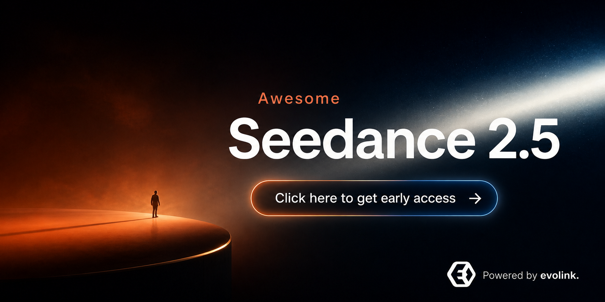</a>

# Offizieller Seedance 2.5 Guide

[](LICENSE)
[](https://evolink.ai/seedream-5-0?utm_source=github&utm_medium=badge&utm_campaign=awesome-seedance-2.5-guide)
[](data/seedance-2-5-manifest.json)
[](https://evolink.ai/signup?utm_source=github&utm_medium=badge&utm_campaign=awesome-seedance-2.5-guide)

[English](README.md) · [Español](README.es.md) · [Português](README.pt.md) · [日本語](README.ja.md) · [한국어](README.ko.md) · **Deutsch** · [Français](README.fr.md) · [Türkçe](README.tr.md) · [简体中文](README.zh-CN.md) · [繁體中文](README.zh-TW.md) · [Русский](README.ru.md)

</div>

## 🍌 Einführung

Seedance 2.5 early access ist über EvoLink geöffnet. Dieses Repository macht aus den offiziellen Launch-Materialien einen GitHub-nativen Guide für Creator, Entwickler und AI-Video-Teams.

Der Guide umfasst 36 offizielle Medien aus Launch-Demos, Showcase-Arbeiten, Narrative Control, multilingualer Darstellung und kontrollierbarer Bearbeitung. Es sind offizielle Fälle, deshalb gibt es keine Autor- oder Source-Zeile je Case.

[Get Seedance 2.5 Early Access](https://evolink.ai/seedream-5-0?utm_source=github&utm_medium=readme&utm_campaign=awesome-seedance-2.5-guide) · [API Key erhalten](https://evolink.ai/signup?utm_source=github&utm_medium=readme&utm_campaign=awesome-seedance-2.5-guide) · [Aktuelle Seedance API Beispiele](https://github.com/EvoLinkAI/Seedance-2.5-Gateway-Service)

> [!NOTE]
> Aktuell lauffähige API-Snippets verwenden weiterhin den stabilen Seedance 2 API-Pfad, während Seedance 2.5 early access ausgerollt wird. Ersetze verifizierte `seedance-2.0-*` model IDs nicht durch unverifizierte 2.5 IDs.

## 📑 Menü

- Einführung
- Schnellstart
- Originaler Seedance 2 Guide
- Offizieller Seedance 2.5 Guide
- Repository-Struktur
- Anerkennung

## 🚀 Schnellstart

Nutze dieses Repository, um offizielle 2.5 Beispiele zu prüfen, Prompt-Strukturen zu kopieren und dem 2.5 Rollout beizutreten.

> [!NOTE]
> Dieser Schnellstart behält absichtlich die verifizierte `seedance-2.0-text-to-video` model ID und den aktuellen Seedance 2 API-Pfad bei. Seedance 2.5 API access kommt über early access; ersetze die lauffähige 2.0 ID noch nicht durch eine unverifizierte 2.5 ID.

```bash
export EVOLINK_API_KEY="your_key_here"

curl --request POST \
  --url https://api.evolink.ai/v1/videos/generations \
  --header "Authorization: Bearer ${EVOLINK_API_KEY}" \
  --header 'Content-Type: application/json' \
  --data '{
    "model": "seedance-2.0-text-to-video",
    "prompt": "A cinematic product reveal, slow dolly-in, reflective glass table, premium commercial lighting",
    "duration": 5,
    "quality": "720p",
    "aspect_ratio": "16:9",
    "generate_audio": true
  }'
```

## 🧭 Originaler Seedance 2 Guide

Der neue offizielle Seedance 2.5 Guide steht zuerst. Der vollständige ursprüngliche Seedance 2 Guide bleibt als Legacy-Sprungziel für den aktuellen API-Pfad, Use-Case-Patterns, Prompt-Vorlagen, Parameterhinweise und multimodale Workflow-Notizen erhalten.

- [Vollständigen originalen Seedance 2 Guide öffnen](seedance-2-guide/README.de.md)
- [Originalen 55-Case-Index öffnen](use-cases/README.md)
- [Englische Seedance 2 Use Cases](use-cases/en/README.md)
- [Chinesisch vereinfacht Seedance 2 Use Cases](use-cases/zh-CN/README.md)
- [Chinesisch traditionell Seedance 2 Use Cases](use-cases/zh-TW/README.md)
- [Aktuelle Seedance API Beispiele](https://github.com/EvoLinkAI/Seedance-2.5-Gateway-Service)

## 🎬 Offizieller Seedance 2.5 Guide

## „Above the Fold“-Video

### Case 1: Above the Fold-Video 1

[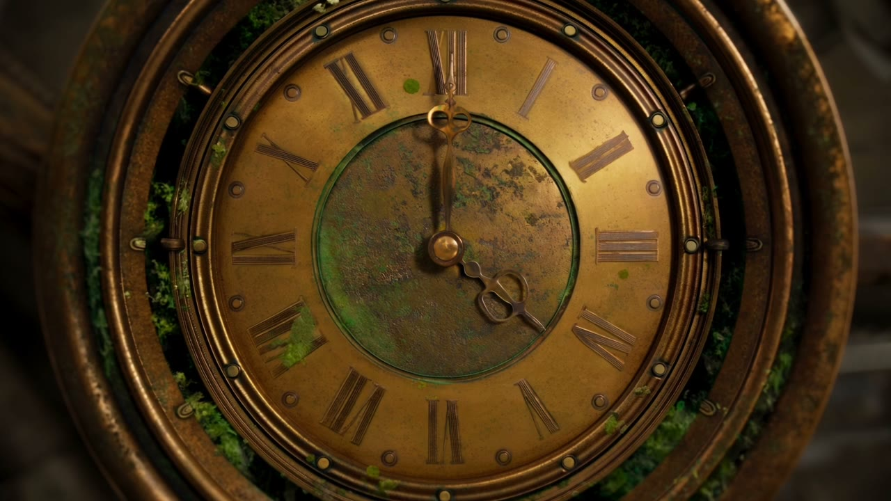](https://ark-common-storage-prod-cn-beijing.tos-cn-beijing.volces.com/presets/experience/gen_video/model-promotion/seedance-2-5/firstScreen/group2/2.mp4)

[Video abspielen](https://ark-common-storage-prod-cn-beijing.tos-cn-beijing.volces.com/presets/experience/gen_video/model-promotion/seedance-2-5/firstScreen/group2/2.mp4) · Klicke auf das Thumbnail, um das Video abzuspielen.

**Prompt:**

```text
Eine hochwertige, filmische 30-sekündige 3D-Motion-Graphics-Sequenz, die exquisite Steampunk- und Retro-Miniaturlandschaftsstile mit kontinuierlichen und sanften Umgebungs- und durchdringenden Kamerabewegungen verwendet.
[0-10 Sekunden]: Makro-Nahaufnahme eines Zifferblatts aus antikem Messing, das sich auf wundersame Weise in ineinandergreifende rotierende Zahnkränze und volumetrischen Nebel entfaltet. Die Kamera dringt durch die Zahnräder nach unten, und ein mechanischer Ornithopter schwebt aus einer Miniaturschlucht aus Stapeln alter alter Bücher in den Himmel.
[10-20 Sekunden]: Die Kamera folgt der Flugbahn des Ornithopters, während er vorwärts gleitet und nahtlos in eine sich mit hoher Geschwindigkeit drehende verzierte Phantombox aus Messing (Zoetrope) eindringt, die dynamisches Licht und Schatten eines galoppierenden mechanischen Pferdes projiziert. Das Licht und der Schatten sprangen aus der Box, und die Szene verwandelte sich augenblicklich in eine hängende Seilbahn mit Messingstruktur, die durch den Wald mechanischer Zahnräder entlang der schimmernden Kupferschienen fuhr, getaucht in goldenes Stundenlicht auf Filmniveau.
[20–30 Sekunden]: Die Kamera schwenkt anmutig nach unten, und ein wunderschönes mechanisches Uhrwerk-Segelboot aus Holz erscheint unterhalb der Seilbahn und schneidet durch die wellenförmigen Wellen aus dunkelblauem Glas. Das Ende der Wellen verwandelte sich nahtlos in einen riesigen leuchtenden Mond, und die Silhouetten einer Gruppe von Entdeckern mit schwankenden Laternen wanderten unter den Sternen über den Kamm der Kristallmine. Die Kamera zoomt in einer sanften Spirale durch ätherische Wolken heraus und zurück zum großen, tickenden Zifferblatt aus Messing.
Technische Spezifikationen: Hyperrealistische mechanische Texturen, satte Messing- und Goldtöne und eine filmisch geringe Schärfentiefe. Sanfte und kohärente nahtlose Shuttle-Bewegung, ein starkes Gefühl für epische und fantasievolle Abenteueratmosphäre.
```

---

### Case 2: Above the Fold-Video 2

[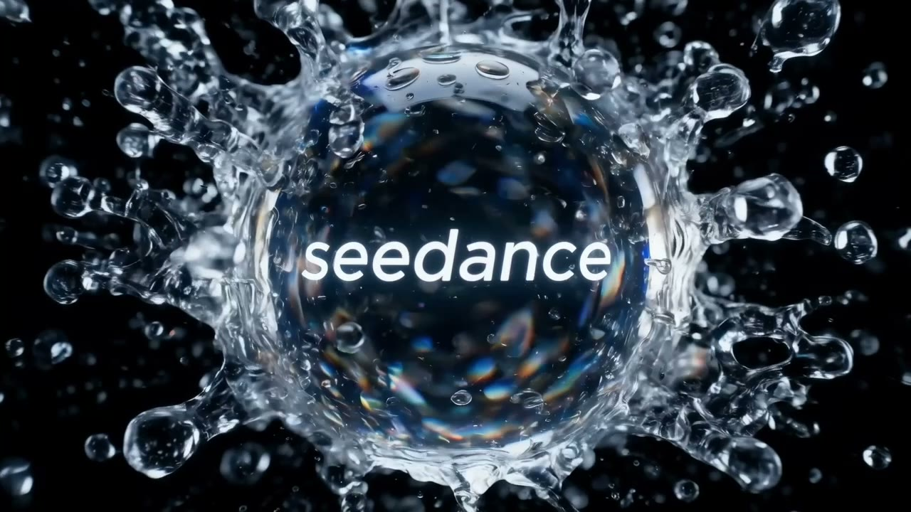](https://ark-common-storage-prod-cn-beijing.tos-cn-beijing.volces.com/presets/experience/gen_video/model-promotion/seedance-2-5/firstScreen/group1/1.mp4)

[Video abspielen](https://ark-common-storage-prod-cn-beijing.tos-cn-beijing.volces.com/presets/experience/gen_video/model-promotion/seedance-2-5/firstScreen/group1/1.mp4) · Klicke auf das Thumbnail, um das Video abzuspielen.

**Prompt:**

```text
Ein rasanter, filmischer Kurzfilm mit nahtlosem Übergang (Match-Cut) und dynamischen elektronischen Beats. In der Mitte des Gemäldes ist immer eine makellose Kristallkugel befestigt, in deren Innenseite das leuchtende „Seedance“-Logo eingraviert ist. Die Kristallkugel behält den extremen Fokus bei, und mit dem kraftvollen Trommelschlag der Musik wechselt der Hintergrund nahtlos und mit hoher Geschwindigkeit:
Szene 1: Makro-Nahaufnahme, filmartiges Wasser, das um die Kristallkugel spritzt und komplexes Licht und Schatten bricht.
Szene 2: Ein Retro-Café am Morgen. Die Kristallkugel wird auf den Holztisch gelegt. Der Hintergrund ist der aufsteigende Kaffeedampf und der verschwommene Pendlerstrom vor dem Fenster.
Szene 3: Zur goldenen Stunde des Abends wirft ein Skateboard fahrender junger Mann mit einer Hand eine Kristallkugel. Der Hintergrund ist die sich schnell verändernde Straßenszene und die wunderschöne Hintergrundbeleuchtung des Sonnenuntergangs.
Szene 4: Beim Frenzy Music Festival halten Menschen Kristallkugeln hoch, die den Bühnenlaser vor einem wunderschönen Hintergrund reflektieren.
Szene 5: Ein lebhafter Familienfeiertisch mit einer Kristallkugel in der Mitte und verschwommenen Figuren im Hintergrund, die einen Toast feiern und Essen einnehmen.
Szene 6: In einem dunklen Kino halten beide Hände eine Kristallkugel, auf deren Oberfläche das schwache Licht der riesigen Leinwand fließt.
Szene 7: Die Kristallkugel wird auf die stark vibrierende Schallmembran gelegt und wechselt mit dem Höhepunkt der Musik nahtlos in die Mitte des rotierenden DJ-Players.
Szene 8: Campingnacht im Freien, der Hintergrund wechselt zu einem warmen Lagerfeuer und schwankenden Lichtpunkten (Bokeh).
Werfen und Ende: Mit dem letzten Akzent der Musik wurde die Kristallkugel hoch über die Leinwand geworfen; Es wurde sofort ein rein schwarzer Hintergrund angezeigt, und das minimalistische weiße Wort „seedance“ auf schwarzem Hintergrund erschien in der Mitte des Bildschirms.
Befolgen Sie genau die dynamische Hintergrundmusik-Rhythmusbearbeitung (steckengebliebener Übergang) und die erstklassige filmische Farbkorrektur (Cinematic Color Grading). Realistische Glasbrechungs- und Transmissionsmaterialien, komplexe Strahlverfolgung und globale Beleuchtung. Das Motiv ist äußerst klar, der Hintergrund weist eine starke dynamische Unschärfe auf und die visuelle Wirkung ist äußerst stark.
```

---

### Case 3: Above the Fold-Video 3

[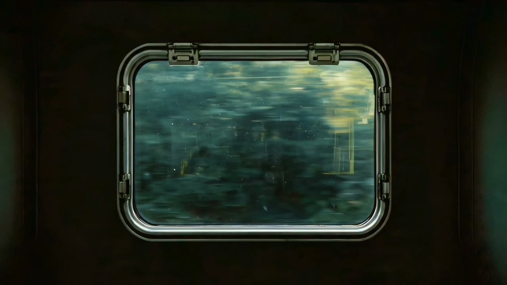](https://ark-common-storage-prod-cn-beijing.tos-cn-beijing.volces.com/presets/experience/gen_video/model-promotion/seedance-2-5/firstScreen/group3/output.mp4)

[Video abspielen](https://ark-common-storage-prod-cn-beijing.tos-cn-beijing.volces.com/presets/experience/gen_video/model-promotion/seedance-2-5/firstScreen/group3/output.mp4) · Klicke auf das Thumbnail, um das Video abzuspielen.

**Referenz-Assets:** 5

**Prompt:**

```text
Kurzfilm zum filmischen Markenkonzept.<<<image_1_1>>>ist das erste Bild, der Bildschirm wackelt leicht, die Kamera zoomt allmählich heran und erreicht den schnell verschwindenden Baumschatten vor dem Fenster. Der Baumschatten weicht immer schneller zurück und schneidet plötzlich zu<<<image_2_2>>>, die Geschwindigkeit verlangsamt sich plötzlich, die Kamera bewegt sich langsam am Bach entlang und die Vögel singen und die Blumen duften.
Die Kamera bewegte sich zum Wasser hinab. Der Soundeffekt beinhaltete das Geräusch von Blasen im Wasser. Eine Gruppe orangefarbener Quallen schwamm anmutig vor der Kamera.<<<image_3_3>>>. Die Kamera zog sich langsam zurück. Eine Gruppe kleiner Fische schwankte an der Kamera vorbei und durch das Wasser ins Fenster.<<<image_4_4>>>. Das Mädchen schaute nach links und rechts und beobachtete den kleinen Fisch.
Die Kamera fährt langsam zurück und das Bild ist unscharf, dann fokussiert sie erneut und das Bild wird klarer und wechselt zum Rhythmus der Musik: Chinesisches Gartenfenster<<<image_5_5>>>Lichtkreise, Kirchenglas-Buntfenster, Flugzeugbullaugen, Kuppeloberlichter, Erkerfenster, Jalousien, europäische Dachgauben, Katzenaugen an Türen, Kamerasucher, Vogelaugen und Nahaufnahmen menschlicher Augen.
Auf dem Bildschirm bleibt eine Nahaufnahme menschlicher Augen zu sehen, dann werden die Augen geschlossen und der Bildschirm wird schwarz. Dann werden plötzlich die Augen geöffnet und das Wort „seedance“ mit Akzent erscheint in der Mitte der Augen.
```

> [!NOTE]
> Dieser offizielle Case enthält außerdem Referenz-Assets im Manifest.

---

## Benutzer funktioniert

### Case 4: Visuelle Effekte 1

[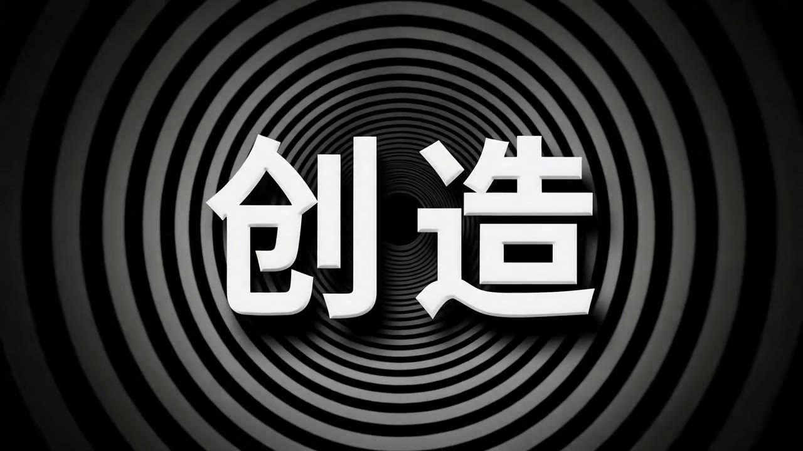](https://ark-common-storage-prod-cn-beijing.tos-cn-beijing.volces.com/presets/experience/gen_video/model-promotion/seedance-2-5/ugc/16-9/169-1.mp4)

[Video abspielen](https://ark-common-storage-prod-cn-beijing.tos-cn-beijing.volces.com/presets/experience/gen_video/model-promotion/seedance-2-5/ugc/16-9/169-1.mp4) · Klicke auf das Thumbnail, um das Video abzuspielen.

**Prompt:**

```text
Ein 15-sekündiges, nahtloses Looping-Video mit kreativer Textanimation, 4K, 30 fps. Jede Sprache dauert etwa 1,2 Sekunden und der Übergang wird durch Textauflösung, Verformung oder Partikelstreuung ohne harte Schnitte erreicht. Die Hintergrundmusik hat einen deutlichen Rhythmus und starke Verzögerungen
0-1,2s Chinesische „Schöpfung“·Op optische Täuschung reiner schwarzer Hintergrund, schwarze und weiße konzentrische Kreise breiten sich von der Mitte aus aus und bilden einen visuellen Tunnel. Das weiße dreidimensionale chinesische Schriftzeichen „Creation“ ragt langsam aus der Mitte des Kreises in Richtung Kamera. Es ist fett und serifenlos mit subtilen Schatten an den Rändern. Die konzentrischen Kreise erzeugen beim Fortschreiten des Textes Wellen und Verzerrungen, wie Wellen auf dem Wasser. Der Text hielt inne, nachdem er vollständig herausragte, löste sich dann in blauen Buntstiftpartikeln auf und schwebte davon.
1,2–2,4 s Englisch „CREATE“ · Handgemalter, warmgelber Kraftpapier-Texturhintergrund mit Buntstift, grobe blaue Buntstiftstriche schreiben das englische „CREATE“ in Großbuchstaben nacheinander. Die Pinselstriche weisen deutliche Pastellkörnigkeit und überlappende Markierungen auf, und die letzte horizontale Linie des E ist leicht erhöht. Nach dem Schreiben weist die Oberfläche der Buchstaben einen leichten wachsartigen Glanz auf und auf dem Hintergrund zeichnen sich schwache Bleistifthilfslinien ab. Der Text wird dann in die Scanlinien der CRT gesaugt und verschwindet.
2,4–3,6 s spanisches „CREAR“ · Dunkler Arcade-Arcade-Rahmen im Retro-Stil, der zentrale CRT-Bildschirm weist subtile Scanlinien und eine Phosphorpulverkörnigkeit auf. Von unten erhebt sich das dreidimensionale Pixelwort „CREAR“ mit blauem und violettem Farbverlauf. Die Oberfläche der Buchstaben hat eine weiße Wellenanimation wie Meereswellen, und der Rand strahlt neonblaues Licht aus. In der oberen linken Ecke des Bildschirms steht „CREDIT 00“ und in der unteren rechten Ecke blinkt „INSERT COIN“. Der Text verpixelte sich dann und löste sich in ein Indigo-Batikmuster auf.
3,6–4,8 cm indonesischer „CIPTAKAN“ · Batikstoff. Dunkler indigoblauer Hintergrund aus traditionellem indonesischem Batikstoff, mit feinen parabolischen Mustern auf der Stoffoberfläche. Die weiße Serifenschrift „CIPTAKAN“ erhebt sich langsam von der Unterseite des Stoffes, wie beim Heißprägen, und der Stoff erzeugt beim Heraustreten des Textes echte Falten und Schwankungen. Nachdem die Worte erschienen waren, wurde das Tuch vom Wind aufgewirbelt und die goldenen Trümmer flogen umher und verwandelten sich in islamische geometrische Muster.
4,8–6,0 Sek. Malaiisches „CIPTA“·Islamische Geometrie. Dunkelgrüner Samthintergrund, goldene arabeske geometrische Muster breiten sich von den vier Ecken bis zur Mitte aus. Das weiße klassische Serifenwort „CIPTA“ dreht sich und tritt aus der Mitte hervor. Die Buchstaben sind von Sternmustern umgeben und Goldpulverpartikel fallen herunter. Anschließend wurden die Worte wörtlich mit einem goldenen Gravurmesser in die schwarze Metalltafel eingraviert.
6,0–7,2 s Thailändisches „สร้างสรรค์“ · Goldfoliengravur auf schwarzem Hintergrund, thailändisches „สร้างสรรค์“ wird in Gold präsentiert, als wäre es aus einer alten Tempeltafel geschnitzt. Es gibt eine subtile Animation der Goldfolie, die sich von der Oberfläche des Textes ablöst und die darunter liegende dunkelrote Grundierung zum Vorschein bringt, während goldene Scherben umherfliegen. Nachdem die Gravur abgeschlossen ist, verschmelzen die Worte zu silbernen Quecksilbertropfen und tropfen.
7,2–8,4 Sekunden Arabisch „إبداع“ · Mechanisches Umblättern. Das schwarze Metalldisplay zum Umblättern nimmt den gesamten Bildschirm ein und die mechanischen Klingen klicken und drehen sich abwechselnd. Der aus weißen Pixelgittern bestehende arabische Text „إبداع“ erscheint einer nach dem anderen von rechts nach links, und jeder Buchstabenwechsel wird von präzisen mechanischen Bewegungen und leichten Vibrationen begleitet. Wenn der Seitenwechsel abgeschlossen ist, wird der Text von einem Sturm bunter Sambafedern hinweggeschwemmt.
8,4-9,6s Portugiesischer „CRIAR“ · Karnevalsfedern. Auf schwarzem Hintergrund laufen bunte Sambafedern vom Bildrand zur Bildmitte hin zu einem riesigen Federfächer zusammen. Die weißen, fett gedruckten Buchstaben „CRIAR“ platzten aus der Mitte des Federfächers, und die Federn flogen unter der Wucht der Worte herum. Die Oberfläche der Worte spiegelte sich in Karnevalspailletten, und die grünen, gelben und blauen Punkte der brasilianischen Flagge blitzten. Anschließend wurde der Text mit schwarzer Tinte ausgewaschen.
9,6–10,8 Sekunden vietnamesisches „SÁNG TẠO“ · Tintenseide. Auf einem cremefarbenen Seidenhintergrund fließt langsam schwarze Tinte vom oberen Bildrand und bildet nach und nach das vietnamesische Wort „SÁNG TẠO“. Die Tinte erzeugt einen natürlichen, verschmierten Rand auf der Seide, und einige der Tintentröpfchen tropfen nach unten und bilden hängende Tintenperlen. Nach der Fertigstellung wurde die Seide vom Wind aufgewirbelt, wodurch das dunkle Muster der darunter liegenden Lotusblume zum Vorschein kam und der Text zu einer transparenten Glaskugel verdichtet wurde.
10,8–12,0 s „Creation“ auf Japanisch · Optisches Glas Eine perfekt transparente optische Glaskugel hängt in der Mitte eines rein schwarzen Hintergrunds. Die Kugel spiegelt den regenbogenfarbenen Astigmatismus wider. Hinter der Glaskugel wird das japanisch-chinesische Schriftzeichen „Creation“ in einer Regenbogenstreuungsprojektion präsentiert. Während sich die Glaskugel langsam dreht, erzeugt der Text eine optische Verzerrung, die sich verdreht, streckt und trennt. Auf der Oberfläche der Glaskugel befinden sich feine Staubpartikel, die dann zu einem silbrigen flüssigen Metall schmelzen.
12,0-13,2 s Koreanisches 「창조」· Flüssiges Metall. Vor dem Hintergrund des tiefen Sternenhimmels tropft silbernes flüssiges Quecksilber vom oberen Bildrand und kondensiert auf natürliche Weise in der Luft zum koreanischen Wort „창조“. Die Oberfläche der flüssigen Zeichen weist eine starke Spiegelreflexion auf und spiegelt die umgebenden Sterne wider. Nachdem die Worte gebildet waren, tropfte ein Teil der Quecksilberflüssigkeit weiter nach unten und bildete hängende Metallperlen. Schließlich sammelte sich die gesamte Metallflüssigkeit in einer riesigen silbernen Kugel.
```

---

### Case 5: Film 2

[](https://ark-common-storage-prod-cn-beijing.tos-cn-beijing.volces.com/presets/experience/gen_video/model-promotion/seedance-2-5/ugc/3-4/34-1.mp4)

[Video abspielen](https://ark-common-storage-prod-cn-beijing.tos-cn-beijing.volces.com/presets/experience/gen_video/model-promotion/seedance-2-5/ugc/3-4/34-1.mp4) · Klicke auf das Thumbnail, um das Video abzuspielen.

**Prompt:**

```text
【Allgemeine Stileinstellung】
Ein 30-sekündiger visueller High-End-Blockbuster auf Markenniveau mit starkem Kinogefühl und High-End-Textur. Das Bild betont verträumte Lichtpunkte (Bokeh), seidige Bewegungsunschärfeübergänge (Bewegungsunschärfe), volumetrische Beleuchtung und den ultrarealistischen Ausdruck materieller Details.
[Storyboard-Beschreibung]
[0-5 Sekunden]: Traumprolog und Makro-Nahaufnahme
Extrem hochwertige Makro-Nahaufnahmen. Eine schlanke Hand streckte sich in die Luft und ihre Fingerspitzen berührten bunte Punkte, so hell und funkelnd wie Sterne. Mit dem Fluss von Licht und Schatten geht die Szene nahtlos und fließend zu einer eleganten Frau über, die einen reinweißen Tüllrock trägt und betrunken auf einem Vintage-Klavier spielt. Geringe Schärfentiefe, der Hintergrund verschwimmt zu einem wunderschönen blaugrünen Ton.
[5-15 Sekunden]: Dann Schnitt zu einer sanften Folgeaufnahme: Eine Frau mit einem französischen Strohhut mit breiter Krempe und einem fließenden weißen Rock läuft leichtfüßig über den dichten Blumenweg voller rosa-orangefarbener Rosen und blauer Hortensien. Das Licht wirft gesprenkeltes Licht und Schatten durch die Blätter und bringt die sanfte Brise, die realistische Physik des flatternden Rockstoffs und die ultrarealistische Textur der Blütenblätter perfekt zur Geltung.
[15-24 Sekunden]: Ruhige Ästhetik und Licht- und Schattenbrechung
Der Rhythmus der Kamera verlangsamt sich und geht in die ultimativ schöne Zeitlupe (Zeitlupe) über. Ein Mädchen sitzt an einem schwarzen schmiedeeisernen Tisch neben einem europäischen Retro-Goldbrunnen und liest leise. In der Luft schweben kristallklare Seifenblasen, und die Oberfläche der Blasen spiegelt perfekt die umliegenden Blumen und den warmen Sonnenschein wider. Der Moment, in dem Wassertropfen spritzen, ist deutlich sichtbar und demonstriert die erstklassigen Rendering-Fähigkeiten des Modells für transparente Materialien, Wasserbrechung und komplexe Beleuchtung.
```

---

### Case 6: Postproduktionseffekte 3

[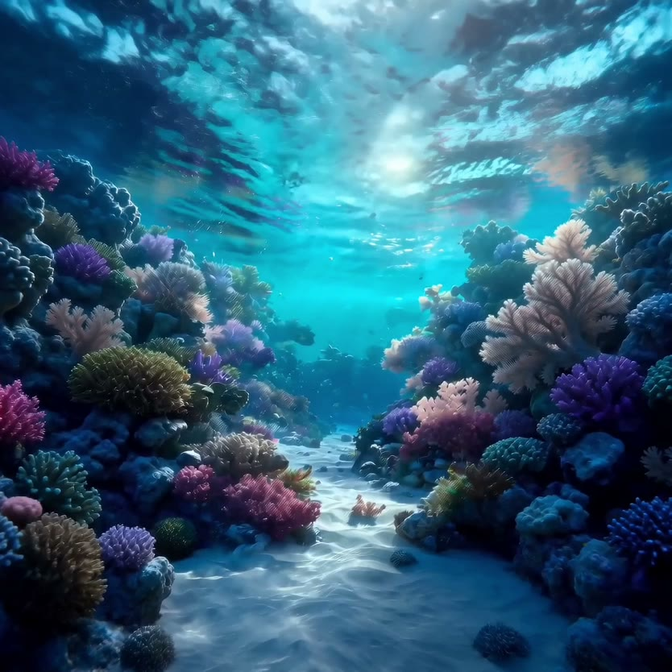](https://ark-common-storage-prod-cn-beijing.tos-cn-beijing.volces.com/presets/experience/gen_video/model-promotion/seedance-2-5/ugc/1-1/11-1.mp4)

[Video abspielen](https://ark-common-storage-prod-cn-beijing.tos-cn-beijing.volces.com/presets/experience/gen_video/model-promotion/seedance-2-5/ugc/1-1/11-1.mp4) · Klicke auf das Thumbnail, um das Video abzuspielen.

**Prompt:**

```text
Eine Tiefsee-Korallenriffszene, eine tropische Unterwasserwelt, die von Blau dominiert wird, mit einem großen Bereich gesunder und wohlhabender bunter lebender Korallen, darunter Zweigkorallen, Hirnkorallen, Scheibenkorallen und Weichkorallen, mit einer großen Anzahl tropischer Fische, die auf natürliche Weise zwischen ihnen hin und her pendeln. Die Nahansicht ist klar und lebendig, während die Fernansicht allmählich blauer und grauer wird und der Kontrast schwächer wird. Das natürliche Licht oben wird durch das Meerwasser gefiltert, um ein weiches, volumetrisches Licht zu erzeugen. Im Meerwasser gibt es kleine Schwebeteilchen und ein leichtes Strömungsgefühl. 8-12 in verschiedenen Größen. Der schirmförmige Körper hat einen sanften Biolumineszenzeffekt, die Tentakel flattern sanft mit den Wellen und an den Enden der Tentakel befinden sich schwache violette Lichtpunkte. Die Größe der Qualle steht im Verhältnis zu den Korallen und Fischen und der Lichteffekt ist weich und blendfrei und bildet verträumte Lichtpunkte auf dem dunklen Meerwasserhintergrund. Die Bewegung des Quallenschwarms ist natürlich, in einer langsam ansteigenden Spirale, und einige Quallen schwimmen an der Vorderseite der Linse vorbei, wodurch ein leichter Lens Flare-Effekt entsteht. Durch die blaue Beleuchtung unter Wasser harmoniert das Leuchten der Quallen harmonisch mit den schwachen Reflexionen der umliegenden Korallen. Während des Schwimmvorgangs der Quallengruppe entstanden Blasen, die nach oben schwebten und im Meer das Wort „Seedance“ bildeten.
```

---

### Case 7: Film 4

[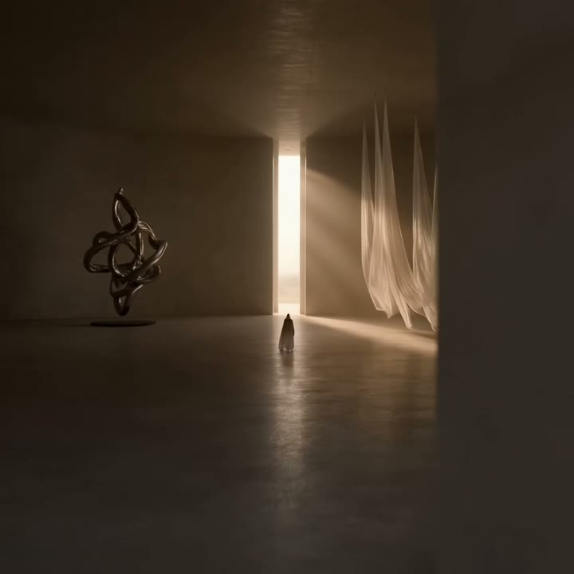](https://ark-common-storage-prod-cn-beijing.tos-cn-beijing.volces.com/presets/experience/gen_video/model-promotion/seedance-2-5/ugc/1-1/11-2.mp4)

[Video abspielen](https://ark-common-storage-prod-cn-beijing.tos-cn-beijing.volces.com/presets/experience/gen_video/model-promotion/seedance-2-5/ugc/1-1/11-2.mp4) · Klicke auf das Thumbnail, um das Video abzuspielen.

**Prompt:**

```text
Filmische Textur, High-End-Gefühl, goldene Wüste am Morgen, ein minimalistisches weißes Kunstmuseumsgebäude, das über den Sanddünen schwebt, mit feinen Steintexturen und sanften Reflexionen auf der Gebäudeoberfläche. Sonnenlicht dringt durch Sand und Staub und erzeugt volumetrisches Licht, und die Dünen in der Ferne sind deutlich geschichtet. Die Kamera beginnt mit einem Ultraweitwinkel-Wüstenpanorama, bewegt sich langsam vorwärts, durchdringt den fliegenden Sand und dringt in das Innere des schwimmenden Gebäudes ein. Im Innenraum sind schwebende Skulpturen, durchscheinende Seideninstallationen und eine Figur in einem weißen Gewand zu sehen, dessen Stoff sich auf natürliche Weise im Wind wiegt. Die Kamera bewegt sich sanft um die Charaktere herum, und schließlich öffnen sich die Gebäudewände langsam und geben den Blick auf eine weite Fläche aus Himmel und Wüste frei. Hochwertiger künstlerischer Werbestil, echte Beleuchtung, exquisite Materialien, Komposition auf Filmniveau, elegante Bewegung, surreal, aber authentisch.
```

---

### Case 8: Werbung 5

[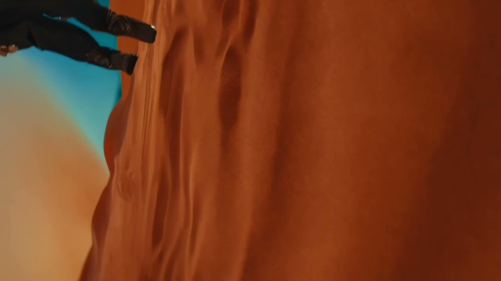](https://ark-common-storage-prod-cn-beijing.tos-cn-beijing.volces.com/presets/experience/gen_video/model-promotion/seedance-2-5/ugc/16-9/169-2.mp4)

[Video abspielen](https://ark-common-storage-prod-cn-beijing.tos-cn-beijing.volces.com/presets/experience/gen_video/model-promotion/seedance-2-5/ugc/16-9/169-2.mp4) · Klicke auf das Thumbnail, um das Video abzuspielen.

**Prompt:**

```text
Ein 30-sekündiger Markenkonzept-Kurzfilm auf hohem Niveau mit großer visueller Spannung. Die Eröffnung nimmt eine surreale Umkehrperspektive ein. Die Kamera dreht sich mit der Schwerkraft und zeigt die Füße des Models in Retro-Wildlederstiefeln, die leichtfüßig über die welligen roten Sanddünen treten. Die Makrolinse verdeckt die mattierte Samtstruktur der Stiefeloberfläche und die darauf verschmutzten rauen roten Sandpartikel. Dann kommt es zu einer Reihe von Montagen voller Schwerelosigkeit und verträumter Farben: Junge männliche und weibliche Models fallen leicht nach hinten, inmitten des wogenden bernsteinfarbenen Windes und Sandes und des kalten Randlichts; Die Kamera schneidet schnell zu einer sehr scharfen Nahaufnahme des Gesichts – Wind und Sand wehen durch die mit winzigen goldenen Sandflecken befleckten Wimpern, und das Model trägt eine Retro-Sonnenbrille mit Metallrahmen, die sengende Sonne und der Sturm der Wildnis spiegeln sich deutlich in den gebogenen Gläsern. Dann strichen die Finger, die alte und dicke Silberringe trugen, sanft über die rauen Felswände und das im Wind tanzende Schilf.
Die Bilder nutzen ausgiebig eine äußerst ausdrucksstarke Linsensprache: Durch eine Makrolinse mit sehr geringem Winkel, durch die verschwommenen und klaren natürlichen Mineralkristalle werden der tiefe und weite Sternenhimmel und die mutwillig reisenden Entdecker von oben eingefangen. Die große Szene ist dicht mit hochwertigen Nahaufnahmen durchsetzt: die Textur des im Wind raschelnden Flammleinenhemds, die straffe und kalte Kinnpartie des Models und der Schweißglanz auf der Haut am Hals, der im Gegenlicht glänzt. Durch die Kombination von Fischaugenobjektiven, schnell rotierenden Kamerabewegungen und seidigen visuellen Versetzungsübergängen entsteht eine geheimnisvolle Dynamik, die avantgardistisch und voller wilder Spannung ist.
Am Höhepunkt des Kurzfilms zoomt die Kamera dramatisch heraus, durchbricht die „vierte Wand“ und zeigt, dass es sich tatsächlich um ein fortschrittliches virtuelles Studio mit einem riesigen kreisförmigen LED-Sternbahndach und einer echten roten Sandfläche handelt, das perfekt mit der Weite der Wildnis und dem Flair eines bahnbrechenden Industriestudios kollidiert. Am Ende verlangsamt sich das Tempo und kehrt zu einer Nahaufnahme zarter Texturen zurück: Eine Frau mit zerzausten Haaren lehnt an einem Retro-Geländewagen. Die Kamera fährt langsam über den fleckigen und abblätternden schweren Metalllack des Fahrzeugs. Lässig lässt die Frau den feinen Sand in ihrer Handfläche von ihren Fingern gleiten. Das kühle und helle Seitenlicht des Mondlichts umreißt präzise die rauen Stoffporen der abgenutzten Lederjacke, das kalte Licht, das vom schweren Metallreißverschluss reflektiert wird, und die kalte dreidimensionale Gesichtskontur der Frau. Das Gesamtdesign präsentiert eine Farbästhetik auf Retro-Filmniveau mit tiefem Nachtblau, das mit feurigem Mineralorange verflochten ist. Das Bild ist atmosphärisch, frei und voller hochwertiger Markenspannung. Schließlich erscheint der Text „seedance“ anmutig in der Bildmitte.
```

---

### Case 9: Film 6

[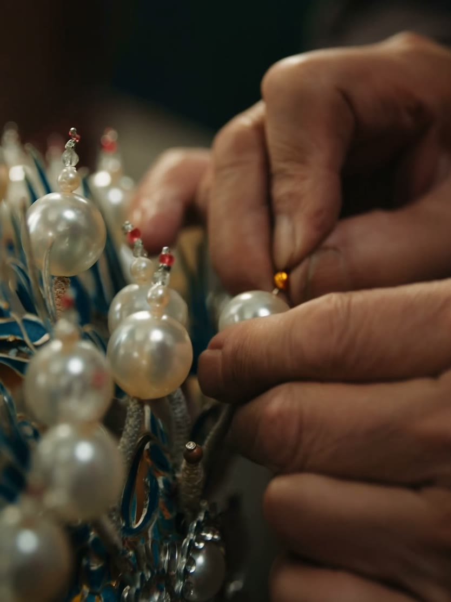](https://ark-common-storage-prod-cn-beijing.tos-cn-beijing.volces.com/presets/experience/gen_video/model-promotion/seedance-2-5/ugc/3-4/34-2.mp4)

[Video abspielen](https://ark-common-storage-prod-cn-beijing.tos-cn-beijing.volces.com/presets/experience/gen_video/model-promotion/seedance-2-5/ugc/3-4/34-2.mp4) · Klicke auf das Thumbnail, um das Video abzuspielen.

**Prompt:**

```text
Kurzfilm zum immateriellen Kulturerbe der Peking-Oper mit filmischem Flair, orientalischer Ästhetik, Wärme und Zurückhaltung. Hinter den Kulissen traditioneller Theatergruppen und Handwerksbetriebe stellen Handwerksmeister in aller Stille Kopfbedeckungen für die Peking-Oper her, arrangieren Kostüme und skizzieren das Gesichts-Make-up. Die Details ihrer Hände sind fein und die Seidenfäden, Perlen, Farben und Stickmuster sind alle von hoher Qualität. Ein junger Lehrling schaute aufmerksam zu, nahm dann sorgfältig die Werkzeuge entgegen und führte unter Anleitung des Meisters die kleinen Schritte aus. Der alte Meister richtete seinen Kopf auf und richtete seine Kleidung, als würde er ihm sanft ein Handwerk und eine Emotion in die Hände geben. Schließlich war der junge Mann ordentlich gekleidet und stand neben der Bühne, wo er gerade auf die Bühne gehen wollte. Das schwache Licht beleuchtete sein Kostüm und sein Profil, und der alte Meister schaute ruhig hinter ihm zu. Die Gesamtatmosphäre ist ruhig, liebevoll und hat einen Hauch von Tradition, mit wenigen Untertiteln und passenden Zeilen dazwischen.
```

---

### Case 10: Spiel 7

[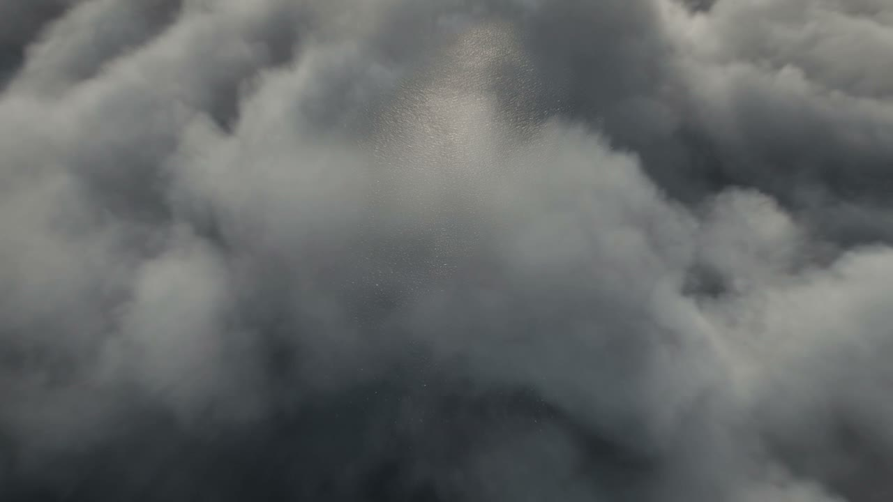](https://ark-common-storage-prod-cn-beijing.tos-cn-beijing.volces.com/presets/experience/gen_video/model-promotion/seedance-2-5/ugc/16-9/169-3.mp4)

[Video abspielen](https://ark-common-storage-prod-cn-beijing.tos-cn-beijing.volces.com/presets/experience/gen_video/model-promotion/seedance-2-5/ugc/16-9/169-3.mp4) · Klicke auf das Thumbnail, um das Video abzuspielen.

**Prompt:**

```text
„Ozeanische Zivilisation“
(Epische Science-Fiction / Dune × Interstellar / Keine reale Person / Skulptur-Lebensform)
[0–5 Sekunden | Kosmische Öffnung·Ozean als planetarisches Gedächtnis]
Der tiefblaue Ozean nimmt die gesamte Szene ein und die extrem tiefen Gewässer weisen eine Schichtstruktur auf, genau wie das flüssige Universum im Inneren des Planeten.
Die Kamera fällt langsam aus großer Höhe senkrecht nach unten, durchdringt Wolken und Meeresnebel und dringt ins Meer ein.
Die Meeresoberfläche schwankt wie ein Metallfilm und bricht unregelmäßige Risse in den Sonnenstrahlen, wodurch ein episches volumetrisches Licht entsteht.
[5–10 Sekunden | Eintritt in die Tiefsee-Zivilisationsstörung]
Die Linse durchdringt die Meeresoberfläche und gelangt in die Tiefsee.
Nach und nach entstand die riesige „unterseeische Zivilisationsstruktur“:
Zerbrochene ringförmige Megastrukturen, versunkene Steinkuppeln und schwebende geometrische Ruinenplattformen.
Der Strukturstil kombiniert antike Tempel mit dem Sinn für außerirdische Zivilisationstechnologie (ähnlich der Sprache der Dünenruinen).
Im Wasser schweben schimmernde Partikel, die wie Sternenstaub langsam durch das Wasser treiben.
[10–15 Sekunden | Eine Lebensform der Skulptur erscheint (nicht menschlich)]
In der Mitte des Theaters steht eine riesige Skulptur einer Lebensform:
Eine „humanoide Statue“ aus weißem Stein und durchscheinenden Mineralien, jedoch ohne lebende Details (keine Haut, keine echten menschlichen Gesichtszüge).
Seine Haltung ähnelt einer alten Ritualstruktur und sein Körper hat eine segmentierte geometrische Struktur, ähnlich dem Erinnerungsträger der Zivilisation.
Die Oberfläche der Skulptur wurde lange Zeit vom Wasser erodiert und ist mit Algen und Korallenkristallstrukturen bedeckt.
Die Kamera umkreist langsam die Skulptur und erzeugt so ein „Gefühl der Ankunft der Götter“.
[15–20 Sekunden｜Die Zivilisation ist erwacht.Optischer Fluss aktiviert]
Die gesamten Unterwasserruinen begannen zu „erwachen“.
Im Inneren der Skulptur erscheinen schwache, energiefließende Lichtmuster, die wie ein neuronales Netzwerk aufleuchten.
Die zerbrochenen Steinsäulen erheben sich langsam und ordnen sich neu, um eine ringförmige Theaterstruktur zu bilden.
Der Wasserkörper begann einen „geordneten Fluss“ zu zeigen, als ob der Raum neu berechnet würde.
Die Kamera ist von statischer → leicht beschleunigter Rotation umgeben.
[20–24 Sekunden | Umkehrung der Meeresoberfläche · steigender Durchbruch]
Die Kamera beschleunigt plötzlich nach oben und aus dem Meer heraus.
Das Meerwasser teilte sich zu beiden Seiten und bildete einen riesigen Wasservorhang.
Der Rumpf eines riesigen Raumschiffs/Tempels einer alten Zivilisation erhebt sich aus dem Meeresgrund:
Es sieht aus wie eine Mischung aus einem Steintempel und einem Science-Fiction-Schiff, dessen Oberfläche mit Korallen und mineralisierten Strukturen bedeckt ist.
Der Rumpf des Schiffes erhebt sich wie ein Wasserfall mit dem Meerwasser.
[24–27 Sekunden | Epische Drehaufnahme (visueller Höhepunkt)]
Die Kamera dreht sich mit hoher Geschwindigkeit um das Riesenschiff (Spiralorbit-Aufnahme).
Die Sonne dringt durch die Risse in den Wolken und bildet eine heilige Lichtsäule.
Der Wasserfluss wird gedreht und in eine Spiralform gezogen, ähnlich einer Galaxienstruktur.
Der Rumpf dreht sich langsam um und gibt den Blick auf seine massive Struktur frei:
Ähnlich wie bei „mobilen Zivilisationsrelikten“ und nicht beim Transport.
【27–30 Sekunden｜Ultimative Vision · Das Ausmaß der Zivilisation enthüllen】
Die Kamera zoomt sehr schnell auf eine Perspektive auf Raumniveau heraus.
Der Ozean, Ruinen, aufsteigende Riesenschiffe und Skulpturentempel sind vertikal auf demselben Bildschirm angeordnet:
Bildung der dreiteiligen kosmischen Struktur der „Unterseezivilisation-Meeresoberfläche-Himmellichtschicht“.
Die ganze Welt ist wie ein erwachtes Erinnerungssystem eines alten Planeten.
Am Ende verblasste das Bild langsam zu einem schwarzen Bildschirm, von dem nur noch schwache Lichtflecken übrig blieben.
Epische Science-Fiction-Ästhetik / Dünenwind und Sandmeer-Zivilisationsstruktur / Räumlicher Maßstab auf interstellarer Ebene / Charakterlose Erzählung / Skulpturen-Zivilisationsruinen / Außerirdische Tempelstruktur / Volumetrisches Licht, das Meerwasser durchdringt / Einsturz und Neuordnung riesiger Gebäude / Heilige Ritualaufnahmen / Spiralspiegelbewegung / Ozean aus Sternenstaubpartikeln / Realität auf Filmebene mit hohem Dynamikumfang
```

---

### Case 11: Film und Fernsehen 8

[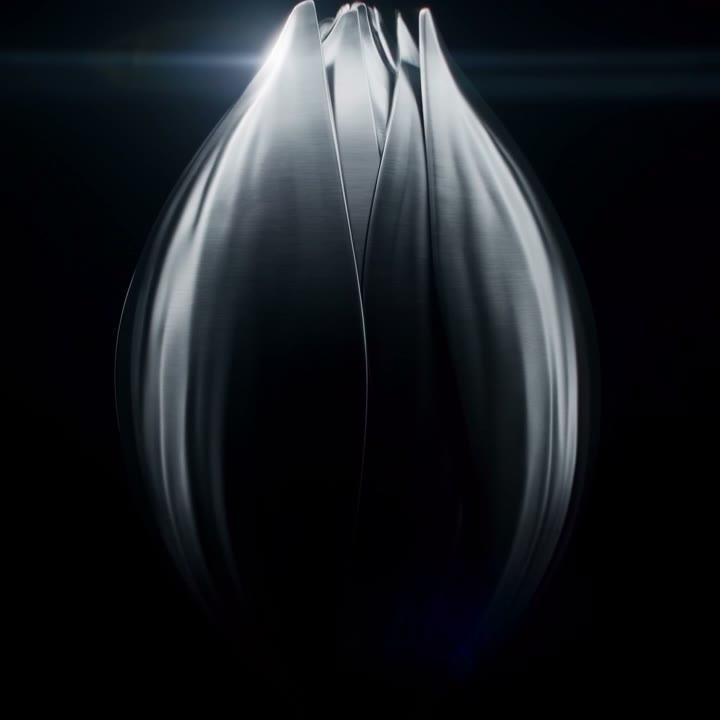](https://ark-common-storage-prod-cn-beijing.tos-cn-beijing.volces.com/presets/experience/gen_video/model-promotion/seedance-2-5/ugc/1-1/11-3.mp4)

[Video abspielen](https://ark-common-storage-prod-cn-beijing.tos-cn-beijing.volces.com/presets/experience/gen_video/model-promotion/seedance-2-5/ugc/1-1/11-3.mp4) · Klicke auf das Thumbnail, um das Video abzuspielen.

**Prompt:**

```text
Das Thema ist „Mechanische Blumenblüte“. Das Bild muss die Vorteile des generierten Videomodells in Bezug auf Licht und Schatten, künstlerische Details, Realismus, Kamerabewegung und filmisches Charaktergefühl hervorheben. Der Gesamtstil ist eine High-End-Technologie-Markenwerbung mit starker visueller Wirkung. Das Video verwendet eine One-Shot-Makroaufnahme, die bei den metallischen Blütenknospen im Dunkeln beginnt, sich nach und nach in die präzise mechanische Struktur im Inneren der Blütenblätter einfügt und schließlich mit dem vollständigen Aufblühen der mechanischen Blume und dem sich nach außen ausbreitenden Licht als Höhepunkt endet. Erfordert echte physische Beleuchtung, exquisite Metall- und Glasmaterialien, feine mechanische Bewegung, stabile Komposition, Farbkorrektur auf Filmniveau und keine Untertitel
```

---

### Case 12: Populärwissenschaft 9

[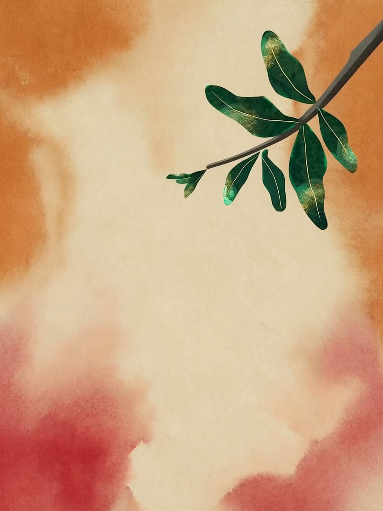](https://ark-common-storage-prod-cn-beijing.tos-cn-beijing.volces.com/presets/experience/gen_video/model-promotion/seedance-2-5/ugc/3-4/34-3.mp4)

[Video abspielen](https://ark-common-storage-prod-cn-beijing.tos-cn-beijing.volces.com/presets/experience/gen_video/model-promotion/seedance-2-5/ugc/3-4/34-3.mp4) · Klicke auf das Thumbnail, um das Video abzuspielen.

**Prompt:**

```text
Allgemeine Anforderungen an den Stil: Felsfarbanimation, dekorative Ästhetik des Orients und der Seidenstraße, Mineralpigmenttextur, Zinnoberrot, Ocker, Steingrün, Ultramarin, Goldverzierungen, Papier- und Wandtexturen, Ebenenschichtung, keine echte Fotografie, kein 3D-Realismus. Der Rhythmus des Bildes wechselt von Stille zu Bewegung und dann von Bewegung zurück zur Stille, was das Gefühl der Reise und des Reichtums von „Vom Land zur Tasse“ hervorhebt. Die Musik ist fröhlich und im westlichen Stil.
Aufnahme 1: Die Zweige beginnen zu erscheinen und die Fülle beginnt (0-4 Sekunden)
Auf dem Papier des Seidenstraßengemäldes erblühen Ocker- und Zinnoberrotblöcke, und auf der rechten Seite des Gemäldes erstreckt sich ein Granatapfelzweig. Die Blätter sind dick und weisen deutliche Schichten mineralischer Pigmente auf. Langsam erschien ein praller Granatapfel auf dem Zweig. Sein Panzer war rot mit Gold darin und sein Umriss war rund und ruhig. Das Sonnenlicht fällt auf die Schale mit goldenen runden Flecken und Goldfolienpunkten. Die Oberfläche des Granatapfels hat einen warmen Glanz, wie eine mit der Zeit gereifte Frucht. Das Eröffnungstemperament ist reich, aber zurückhaltend.
Schuss 2: Sanft abnehmen und die Reise beginnt (4-7 Sekunden)
Der Granatapfel wurde von einem Dienstmädchen aus den westlichen Regionen behutsam mit sanften und eleganten Bewegungen gepflückt. Nach und nach tauchen im Hintergrund lockige Grasmuster, antike Muster und dekorative lange Schriftrollen auf, was darauf hindeutet, dass es aus einem fernen Land stammt. Das Bild geht auf natürliche Weise von statischen Verzweigungen zur Entfaltung der Reise über. Berge, Straßen und Städte beginnen sich flach im Hintergrund auszubreiten, wie eine lange Seidenstraße, die sich langsam entfaltet.
Aufnahme 3: Überqueren alter Straßen und Überqueren von Bergen und Flüssen (7–13 Sekunden)
Die Silhouetten des Kamelgespanns bewegen sich langsam vorwärts, die Glocken stellen mit winzigen goldenen Punkten den Rhythmus dar und im Rucksack des Kamels erscheinen Granatäpfel. Die alte Straße führt durch Sanddünen, Oasen und Stadttore. Wind und Sand ziehen in fließenden Mustern vorbei und die durch die goldene Linie umrissene Straße erstreckt sich weiterhin in die Ferne. Die Farben sind kräftig und hochwertig, wie eine Mischung aus Seidenstraßen-Wandgemälden und Illustrationen in Felsfarben. Der Granatapfel war während der langen Reise immer hell und voll, als hätte er bis heute den Sonnenschein, die Wärme und den Reichtum des fernen Landes bewahrt.
Aufnahme 4: Übergang zwischen Antike und Moderne, Ankunft im gegenwärtigen Moment (13-16 Sekunden)
Die alten Muster und architektonischen Umrisse im Hintergrund werden nach und nach vereinfacht und die Zeit geht sanft in den modernen Raum über. Der Granatapfel wird auf einer modernen Arbeitsplatte platziert und die Tischplatte und die Utensilien werden mit einer einfachen, ebenen Geometrie präsentiert. Die antiken und modernen Visionen sind im selben Bild verbunden, und der Bildrhythmus wechselt von „Reisen“ zu „Ankommen“.
Aufnahme 5: Granatapfel schneiden, visueller Höhepunkt (16-20 Sekunden)
Schneiden Sie den Granatapfel vorsichtig mit einer Hand und mit langsamen und zurückhaltenden Bewegungen auf. Der Moment, in dem sich die Schale öffnet, ist sehr rituell.
Schuss 6: Zu Saft gepresst, reichlich fließend (20–24 Sekunden)
Die Kerne gelangen in das Gefäß und werden zu reichhaltigem Granatapfelsaft gepresst. Die Flüssigkeit fließt mit einer tiefroten und transparenten Textur und feinen steinfarbenen Partikeln. Granatapfelsaft wird langsam in ein modernes Glas gegossen. Der Umriss des Glases ist klar und prägnant. Die rote Flüssigkeit steigt im Glas auf, mit leichten Wellen und Glanzlichtern auf der Oberfläche. Ein paar Eiswürfel fielen in die Tasse und das kalte Weiß und das tiefe Rot bildeten einen scharfen Kontrast. An der Wand des Bechers erschienen feine Wassertropfen und das erfrischende Gefühl war erfüllt.
Aufnahme 7: Modernes Trinken, Reise zur Vollendung (24-27 Sekunden)
Der Hintergrund ist in eine moderne Lebensszene eingeschnitten, und das Fensterlicht, die Tischplatte, die Stoffe und die Pflanzen behalten flache dekorative Elemente und warme Farben bei. Der Saftbecher steht in der Mitte des Bildes und ist vage mit Mustern antiker Straßen, Kamelkarawanen und Stadttoren überlagert, was darauf hindeutet, dass dieser Saftbecher von einer langen Reise stammt. Die Atmosphäre ist reichhaltig, warm und ruhig.
Einstellung 8: Die Zeit konvergiert, Ende im Posterstil (27–30 Sekunden)
Die alten Straßenmuster im Hintergrund verschmelzen allmählich mit dem modernen Raum, wie die Zeit, die in diesem Glas Saft zusammenläuft. Das Bild blitzt kurz auf den Granatapfel auf dem Ast, den Schatten des Kamels auf der alten Straße und die roten Samen zurück, die einen kompletten Kreislauf „vom Boden bis zur Tasse“ bilden. Abschließend wird es zu einer Werbeplakat-ähnlichen Komposition zusammengefasst: Tiefroter Granatapfelsaft wird in die Mitte gelegt, daneben ein gesprungener Granatapfel, umgeben von antiken Straßenmustern, goldenen Lichtpunkten und Elementen des modernen Lebens. Das Bild ist ruhig, aber voller Lebendigkeit, wie eine Reise durch Zeit und Land, die endlich im gegenwärtigen Moment angekommen ist. Der Werbeslogan lautet „Seedance, ein Geschenk aus den westlichen Regionen“.
```

---

## Narrative Grenzen verschieben

### Case 13: Die Grenzen der Erzählung durchbrechen – 30 Sekunden Kontinuität – Ausgabe – 1

[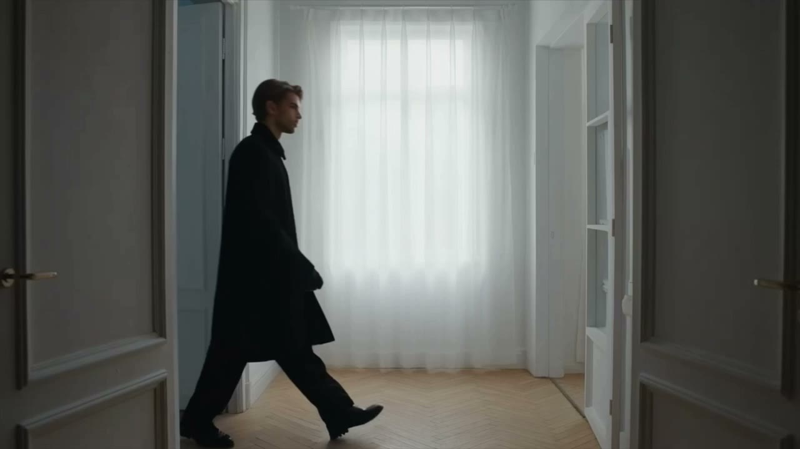](https://ark-common-storage-prod-cn-beijing.tos-cn-beijing.volces.com/presets/experience/gen_video/model-promotion/seedance-2-5/part1/tab1/group1/output.mp4)

[Video abspielen](https://ark-common-storage-prod-cn-beijing.tos-cn-beijing.volces.com/presets/experience/gen_video/model-promotion/seedance-2-5/part1/tab1/group1/output.mp4) · Klicke auf das Thumbnail, um das Video abzuspielen.

**Referenz-Assets:** 8

**Prompt:**

```text
Von links nach rechts folgt die Kamera stetig einem Mann im schwarzen Mantel (siehe<<<image_1_1>>>) durch sechs miteinander verbundene Räume unterschiedlicher Farben und Atmosphären. Die Struktur jedes Zimmers ist gleich: weiße Wände, helle Holzböden mit Fischgrätenmuster, raumhohe französische Doppelfenster und weiße Gazevorhänge, siehe<<<image_2_2>>>, aber die Landschaft vor dem Fenster und die Innenatmosphäre sind völlig unterschiedlich. Der Protagonist bewegt sich während des Spiels mit konstanter Geschwindigkeit und geht durch jede offene Tür an der Wand.
0–5 Sekunden, der erste Raum, das Thema sind amerikanische Comic-Kämpfe, der Protagonist betritt den Raum und kämpft gegen die Figur (<<<image_3_3>>>), die Figur verliert;
5-10 Sekunden, der zweite Raum, das Thema ist warm, gefühlter Stil, die Szene vor dem Fenster ist ein Sonnenblumenfeld (<<<image_4_4>>>), das Innenlicht ist warm orange und sanft und ein Maler malt Sonnenblumen (<<<image_5_5>>>). Auch der Protagonist verwandelt sich nach dem Betreten in einen Filzstil;
10-15 Sekunden, der dritte Raum, das Thema ist Traurigkeit, das ganze Bild ist im Stil einer schwarz-weißen Comic-Stop-Motion-Animation gehalten, es regnet vor dem Fenster, das Licht drinnen ist kalt und grau, eine Person sitzt allein auf dem Boden in der Mitte des leeren Raums, senkt den Kopf und umarmt seine Knie, und ein Mobiltelefon neben ihm beleuchtet die Anrufschnittstelle, ohne dass jemand antwortet. Nachdem der Protagonist den Raum betritt, schaltet er das Licht im Raum aus und schaltet es sofort wieder ein. Der Raum wird bunt und im Handumdrehen wachsen im ganzen Haus Blumen;
15-20 Sekunden, der vierte Raum, das Thema ist Freude, die ganze Szene ist ein vom Meer durchnässter Raum, siehe<<<image_6_6>>>, der Protagonist schwimmt in den Raum, neben ihm wunderschöne Korallenriffe und Fischschwärme;
20-25 Sekunden, der fünfte Raum, das Thema ist Überraschung, die Szene vor dem Fenster ist voller Feuerwerk am Nachthimmel, siehe<<<image_7_7>>>, das Innenlicht ist farbig und flackert und der Protagonist ist in die jubelnde Atmosphäre verwickelt.
Nach 25-30 Sekunden kommt der Protagonist schließlich in einen leeren Raum, stellt sich in die Mitte und schnippt mit den Fingern. Gleichzeitig ist der Soundeffekt ein Schnappgeräusch, der gesamte Bildschirm ist schwarz und in der Mitte erscheint das Wort „seedance“, siehe<<<image_8_8>>>.
Die Gesamtqualität des Films entspricht dem Stil der High-End-Modewerbung. Das Licht wird vollständig von der Szene vor dem Fenster bestimmt und erzeugt so einen starken emotionalen Kontrast. Das Bild enthält keinen Text.
```

> [!NOTE]
> Dieser offizielle Case enthält außerdem Referenz-Assets im Manifest.

---

### Case 14: Die Grenzen der Erzählung durchbrechen – 30 Sekunden Kontinuität – Ausgabe – 2

[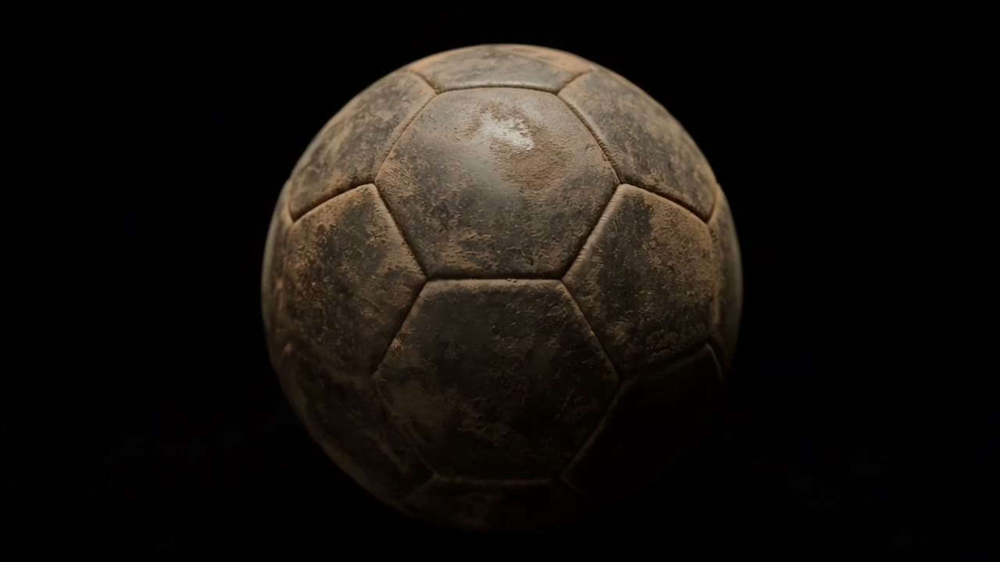](https://ark-common-storage-prod-cn-beijing.tos-cn-beijing.volces.com/presets/experience/gen_video/model-promotion/seedance-2-5/part1/tab1/group2/output.mp4)

[Video abspielen](https://ark-common-storage-prod-cn-beijing.tos-cn-beijing.volces.com/presets/experience/gen_video/model-promotion/seedance-2-5/part1/tab1/group2/output.mp4) · Klicke auf das Thumbnail, um das Video abzuspielen.

**Referenz-Assets:** 3

**Prompt:**

```text
Produzieren Sie ein 30-sekündiges kurzes populärwissenschaftliches Video über die dreitausendjährige Entwicklung des Fußballs. Der gesamte Film verwendet denselben Ball als visuelle Hauptlinie. Der Ball rollt, reist und verformt sich seit der Antike und verbindet so verschiedene Zivilisationen und Epochen. Der Gesamtrhythmus ist kompakt, die Grafik hochwertig, der historisch-wissenschaftliche Kurzfilm wird mit künstlerischen Übergängen kombiniert, um das Gefühl eines dreitausend Jahre alten Balls hervorzuheben, und die mündliche Übertragung ist einfach und kraftvoll.
Zu Beginn tauchte langsam eine antike Kugel mit einer Textur der Zeit auf der Oberfläche aus dem schwarzen Hintergrund auf und rollte dann in eine Cuju-Szene aus der Zeit der Streitenden Reiche in China. Das Bild wurde in einen Freihandstil umgewandelt, der auf den Stil von<<<image_1_1>>>verweist. Alte Menschen in antiken Kostümen spielten im Hof ​​Cuju mit eleganten Bewegungen und der Ball hüpfte unter ihren Füßen. Mündliche Übertragung: Fußballgeschichte, beginnend mit Cuju.
Dann rollt der Ball weiter vorwärts und das Bild geht auf natürliche Weise zu einer antiken griechischen Ballspielszene über. Das Bild ist im Stil eines klassischen Ölgemäldes gehalten und der Stil bezieht sich auf<<<image_2_2>>>. Der Hintergrund des Platzes und der Steinsäulen ist offensichtlich und Menschen in antiken griechischen Gewändern spielen Fußball. Das Bild ist dick und historisch. Mundpropaganda: Auch Griechen lieben Ballspiele.
Dann rollte der Ball ins mittelalterliche Europa, und das Bild behielt noch immer den Stil der Ölmalerei bei. Dörfer, Schlammfelder und einfache Menschen jagten dem Ball hinterher. Die Atmosphäre war warm und rau, genau wie beim alten Volksfußball, der das Feuer weiterführte. Mündliche Übertragung: Das europäische Volk setzt das Fußballspiel fort.
Dann wurde der Ball rausgeschmissen und der Bildschirm wechselte zu einem Schwarz-Weiß-Dokumentarfilm. Bezugnehmend auf<<<image_3_3>>>kamen wir 1863 nach England. Nach und nach entstanden Herren-, Vereins- und Rasenplätze, die die offizielle Geburtsstunde des modernen Fußballs symbolisierten. Dieser Ball zeigte zum ersten Mal das typische Erscheinungsbild des modernen Fußballs. Gesprochen: 1863, der moderne Fußball nimmt Gestalt an.
Dann tritt die Szene schnell in die Moderne ein, wobei sich die Kugel in der Luft dreht und der Reihe nach wichtige Entwicklungsknoten zum Vorschein kommt. Die Lichter, das Stadion, die Zuschauer, die Trophäen und die verschiedenen Szenen auf der ganzen Welt sind miteinander verflochten und zeigen, dass sich Fußball von einer lokalen zu einer globalen Sportart entwickelt hat.
Am Ende befindet sich der Ball in der Mitte eines modernen Stadions, und im Hintergrund verschmelzen Menschenmassen und Jubelrufe aus aller Welt und erzeugen das Gefühl eines „Balls, der die Welt verbindet“. Das Bild ist großartig und episch. Mündliche Übertragung: Fußball verbindet mittlerweile die ganze Welt.
```

> [!NOTE]
> Dieser offizielle Case enthält außerdem Referenz-Assets im Manifest.

---

### Case 15: Die Grenzen der Erzählung durchbrechen – 30 Sekunden Kontinuität – Ausgabe – 3

[](https://ark-common-storage-prod-cn-beijing.tos-cn-beijing.volces.com/presets/experience/gen_video/model-promotion/seedance-2-5/part1/tab1/group3/output.mp4)

[Video abspielen](https://ark-common-storage-prod-cn-beijing.tos-cn-beijing.volces.com/presets/experience/gen_video/model-promotion/seedance-2-5/part1/tab1/group3/output.mp4) · Klicke auf das Thumbnail, um das Video abzuspielen.

**Referenz-Assets:** 6

**Prompt:**

```text
Ein 30-sekündiges Tutorial-Video zur Installation und Verwendung einer Kapselkaffeemaschine.
0-2 Sekunden, der Titeltext am Anfang lautet: Anleitung zur Installation und Verwendung der Seedance-Kapselkaffeemaschine
2–5 Sekunden, Schritt 1: Wassertank installieren, siehe<<<image_1_1>>>Objektiv: Mittlere Aufnahme, leicht von oben gesehen Position: Aktion auf der Rückseite des Rumpfes: Richten Sie den Wassertank mit dem Schlitz auf der Rückseite des Rumpfes aus, drücken Sie ihn vertikal nach unten und hören Sie ein „Klick“-Geräusch, um ihn zu verriegeln. Anforderungen: Zeigen Sie deutlich die Ausrichtungsbeziehung zwischen der Schnalle am Boden des Wassertanks und dem Schlitz am Rumpf an, und die Wasserstandslinie ist im transparenten Teil des Wassertanks zu sehen.
Erzähler: „Zuerst den Wassertank installieren.“
5-9 Sekunden, Schritt 2: Installieren Sie die Tropfschale, siehe<<<image_2_2>>>Objektiv: Nahaufnahme, Vorderansicht, Position: Vor der Unterseite des Rumpfes, Aktion: Schieben Sie die Auffangschale parallel in die Führungsschiene an der Unterseite des Rumpfes und schieben Sie sie, bis die Unterseite vollständig eingepasst ist. Anforderungen: Zeigen Sie den Ausrichtungsprozess der Führungsschiene und verdeutlichen Sie die Leichtgängigkeit des Schiebevorgangs
Erzähler: „Als nächstes richten Sie die Palette an den unteren Schienen aus.“
9–13 Sekunden, Schritt 3: Installieren Sie die Abfallkapsel-Sammelbox, siehe<<<image_3_3>>>Objektiv: Nahaufnahme, leicht erhöhter Blickwinkel, Position: Hohlraum unterhalb der Tropfschale, Aktion: Richten Sie den Auffangbehälter an der Nut aus und schieben Sie ihn bündig mit der Tropfschale hinein. Anforderungen: Zeigen Sie die Passbeziehung zwischen dem Sammelkasten und dem Rumpf und bestätigen Sie, dass er an Ort und Stelle installiert ist
Erzähler: „Dann legen Sie es in die Kapselsammelbox.“
13–18 Sekunden, Schritt 4: erste Wassereinspritzung, siehe<<<image_4_4>>>Objektiv: Nahaufnahme, Seitenansicht, Position: Wassertank oben/hinten am Rumpf, Aktion: Wassertankdeckel öffnen, Wasser bis zum MAX-Wasserstand einfüllen, Wassertankdeckel schließen, Anforderungen: Wasserstandsmarkierung markieren, und das ausströmende Wasser ist deutlich sichtbar
Erzähler: „Öffnen Sie den Deckel des Wassertanks und füllen Sie sauberes Wasser ein. Achten Sie darauf, den maximalen Wasserstand nicht zu überschreiten.“
Der Bildschirm zeigt den maximalen Wasserstand an.
18–25 Sekunden, Schritt 5: Einschalten, siehe<<<image_5_5>>>Aufnahme: Halbnahe Aufnahme, Vorderansicht, Position: Vorderseite des Rumpfes, Aktion: Netzkabel einstecken, Einschalttaste drücken, die Anzeigeleuchte wechselt von Blinken zu Dauerlicht (Vorheizen abgeschlossen), Anforderungen: Nahaufnahme der Statusänderungen der Einschalttaste und der Anzeigeleuchte, die den Prozess des Wartens bis zur Bereitschaft widerspiegeln
Erzähler: „Schließen Sie den Strom an und drücken Sie den Netzschalter.“
25–30 Sekunden, Schritt 6: erstes Spülen (ohne Einlegen der Kapsel), siehe<<<image_6_6>>>Objektiv: mittlere Aufnahme bis Nahaufnahme, Vorderansicht, Position: vor dem Rumpf, Becher unter dem Wasserauslass, Aktion: Entnahmeknopf direkt drücken, ohne die Kapsel einzusetzen, heißes Wasser fließt aus dem Spülrohr und Wasser fließt in den Becher. Anforderungen: Betonen Sie die Aufforderungsmarkierung „Es ist nicht nötig, eine Kapsel einzusetzen“ und zeigen Sie den gesamten Vorgang des Ausspülens des Wassers.
Erzähler: „Der letzte Schritt besteht darin, das erste Mal zu spülen. Sie müssen die Kapsel nicht einlegen, sondern nur die Extraktionstaste drücken. Ihre Kaffeemaschine ist für den offiziellen Gebrauch bereit.“
```

> [!NOTE]
> Dieser offizielle Case enthält außerdem Referenz-Assets im Manifest.

---

### Case 16: Narrative Grenzen verschieben – mehr Referenz-Input-Output-1

[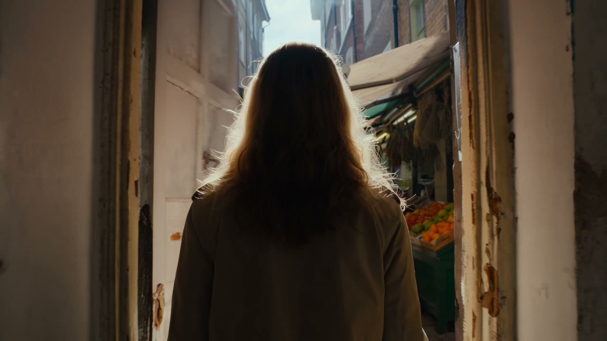](https://ark-common-storage-prod-cn-beijing.tos-cn-beijing.volces.com/presets/experience/gen_video/model-promotion/seedance-2-5/part1/tab2/group1/output.mp4)

[Video abspielen](https://ark-common-storage-prod-cn-beijing.tos-cn-beijing.volces.com/presets/experience/gen_video/model-promotion/seedance-2-5/part1/tab2/group1/output.mp4) · Klicke auf das Thumbnail, um das Video abzuspielen.

**Referenz-Assets:** 17

**Prompt:**

```text
Kernanweisungen: Ein 26-sekündiger One-Shot-Erzählkurzfilm mit stabiler Verfolgung und Verflechtung, siehe<<<video_1_1>>>, und sanfter Surround-Bewegung, siehe<<<video_2_2>>>. Sanftes Reisegefühl. Der Wechsel von Tag und Nacht und der Verlauf der vier Jahreszeiten werden im Objektiv verwirklicht. Die Protagonistin ist eine europäische Frau<<<image_1_3>>>, platziert in einem Meer von Menschen voller Feuerwerkskörper, was das ultimative Gefühl der Einsamkeit und die Qualität der Kinematographie hervorhebt.
Segmentierte Kamerabewegung und Szenenbeschreibung:
0-3 Sekunden (glatte Rückseite): Die alte Holztür<<<image_2_4>>>öffnet sich mit einem Knarren, und die Kamera folgt der Gestalt einer Europäerin, die<<<image_3_5>>>trägt und hinausgeht. An der Schwelle blieb er kurz stehen. Die Straßen vor uns waren mit Licht und Schatten gesprenkelt, und die Geräusche von Feilschen und Menschenmassen näherten sich. Sie wirkte distanziert und ging langsam auf die Straße.
3-6 Sekunden (Rückwärts- und Seitenkamerafahrt): Die Kamera folgt sanft, sie betritt den überfüllten Morgenmarkt, die Atmosphäre bezieht sich auf<<<video_3_6>>>. Auf beiden Seiten drängten sich bunte Obststände und Gewürzläden, und eine Gruppe Straßenjongleure spuckten Feuerdrachen, siehe<<<image_4_7>>>. Der Feuerschein beleuchtete die Menge, aber sie blinzelte nicht und ging in gleichmäßigem Tempo hindurch.
6–9 Sekunden (Smooth Surround von der Seite): Die Kamera beginnt, sich sanft zur Seite und nach vorne zu bewegen und das Seitengesicht des Protagonisten einzufangen. Sie ging an der lauten Metzgerei<<<image_5_8>>>vorbei, und eine junge Mutter ging an ihm vorbei und hielt ein Baby<<<image_6_9>>>in der Hand. Das Baby starrte sie neugierig an, aber sie senkte nur leicht den Blick, um nicht hinzusehen, ohne überhaupt innezuhalten.
9-12 Sekunden (Vorwärts- und Rückwärts-Nachfolgeaufnahme): Die Kamera kreist weiterhin direkt vor dem Protagonisten und führt eine Rückwärts- und Nachfolgeaufnahme durch. Die Menge vor ihnen zog sich plötzlich auf natürliche Weise nach beiden Seiten zurück, so wie Moses das Meer teilte. Ein riesiger Elefant<<<image_7_10>>>, bedeckt mit wunderschönem roten Stoff, erschien mit gleichmäßigem Tempo auf der rechten Seite des Bildschirms und nahm den größten Teil des Bildschirms ein.
12-15 Sekunden (Lückendurchdringung und Zurückspulen): In dem Moment, in dem die Frau und der Elefant zusammenstoßen, gleitet die Kamera geschickt durch die enge Lücke zwischen dem Elefanten und der Frau und zirkuliert zurück zu ihrem Rücken. Die Elefanten zogen gewaltig und lautlos vorbei, und die Bengel jagten ihnen voller Freude nach. Wie Glocken und Gelächter wurde sie nicht einmal langsamer.
15–18 Sekunden (Umgebungslicht- und Schattenverlauf): Während sie geht, verändern sich Licht und Schatten in der Totalen auf magische Weise – das blendende Sonnenlicht im Hochsommer wird augenblicklich weicher, eine Brise rollt die goldenen Blätter<<<video_2_2>>>0 am Himmel auf und die Jahreszeit geht in derselben Totalen nahtlos in den Spätherbst über. Abgefallenes Laub streifte ihre Schultern.
18–21 Sekunden (immersiver 360-Grad-Surround): Die Front fällt plötzlich in ein großes Straßenfest<<<video_2_2>>>1. Bunte Bänder und Papierschnitzel flogen in die Luft, und die Verkäufer beugten sich zum Jubeln hinaus. In diesem Moment entfaltet die Kamera eine kontinuierliche 360-Grad-Schwenkbewegung, wodurch ein äußerst starker visueller Riss zwischen dem stillen und einsamen Protagonisten und der hektischen Umgebung entsteht.
21-24 Sekunden (zurück zur Seite und zurück kreisend): Als die Kamera umkreiste und zu ihrer Seite und zurück zurückkehrte, hatten sich die fallenden Bänder am ganzen Himmel still und leise in Schnee verwandelt – es war augenblicklich Winter<<<video_2_2>>>2. Fußgänger hielten Regenschirme hoch oder setzten Kapuzen auf, und Frauen schrumpften leicht, schlugen ihre Mantelkragen hoch, verwandelten sich in<<<video_2_2>>>3 und gingen allein im Schnee weiter.
24–26 Sekunden (langsames Drücken und Schlagen): Als sie sich dem Ende der langen Straße näherte, verdunkelte sich der Himmel mit einer Geschwindigkeit, die mit bloßem Auge sichtbar war, und der Tag ging nahtlos in die Nacht über. Die gedämpften Straßenlaternen auf beiden Seiten und die Glühbirnen der Stände wurden nacheinander eingeschaltet<<<video_2_2>>>4. Die Verkäufer packten ihre Waren ein. Der Lärm schien durch den starken Schnee langsam absorbiert und entfernt zu werden, und ihre Schritte wurden allmählich langsamer. Plötzlich erblühte ein großes Feuerwerk am Nachthimmel<<<video_2_2>>>5, das Geräusch des aufblühenden Feuerwerks bezieht sich auf<<<video_2_2>>>6. Bunte Lichtpunkte flackerten und sprangen an den Gebäudewänden und in ihre Augen. Die Welt ist immer noch lebendig, aber sie schaut ruhig nach oben, die Kamera zoomt langsam heraus und endet hier sanft.
```

> [!NOTE]
> Dieser offizielle Case enthält außerdem Referenz-Assets im Manifest.

---

### Case 17: Die Grenzen der Erzählung sprengen – mehr Referenzeingabe – Referenzvideo-1-1

[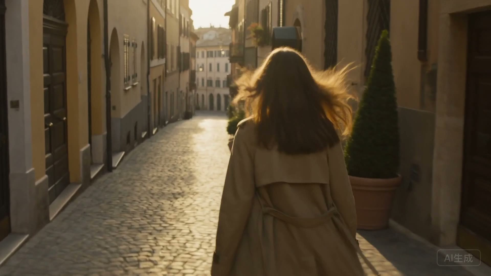](https://ark-common-storage-prod-cn-beijing.tos-cn-beijing.volces.com/presets/experience/gen_video/model-promotion/seedance-2-5/part1/tab2/group1/reference1.mp4)

[Video abspielen](https://ark-common-storage-prod-cn-beijing.tos-cn-beijing.volces.com/presets/experience/gen_video/model-promotion/seedance-2-5/part1/tab2/group1/reference1.mp4) · Klicke auf das Thumbnail, um das Video abzuspielen.

**Referenz-Assets:** 17

**Prompt:**

```text
Kernanweisungen: Ein 26-sekündiger One-Shot-Erzählkurzfilm mit stabiler Verfolgung und Verflechtung, siehe<<<video_1_1>>>, und sanfter Surround-Bewegung, siehe<<<video_2_2>>>. Sanftes Reisegefühl. Der Wechsel von Tag und Nacht und der Verlauf der vier Jahreszeiten werden im Objektiv verwirklicht. Die Protagonistin ist eine europäische Frau<<<image_1_3>>>, platziert in einem Meer von Menschen voller Feuerwerkskörper, was das ultimative Gefühl der Einsamkeit und die Qualität der Kinematographie hervorhebt.
Segmentierte Kamerabewegung und Szenenbeschreibung:
0-3 Sekunden (glatte Rückseite): Die alte Holztür<<<image_2_4>>>öffnet sich mit einem Knarren, und die Kamera folgt der Gestalt einer Europäerin, die<<<image_3_5>>>trägt und hinausgeht. An der Schwelle blieb er kurz stehen. Die Straßen vor uns waren mit Licht und Schatten gesprenkelt, und die Geräusche von Feilschen und Menschenmassen näherten sich. Sie wirkte distanziert und ging langsam auf die Straße.
3-6 Sekunden (Rückwärts- und Seitenkamerafahrt): Die Kamera folgt sanft, sie betritt den überfüllten Morgenmarkt, die Atmosphäre bezieht sich auf<<<video_3_6>>>. Auf beiden Seiten drängten sich bunte Obststände und Gewürzläden, und eine Gruppe Straßenjongleure spuckten Feuerdrachen, siehe<<<image_4_7>>>. Der Feuerschein beleuchtete die Menge, aber sie blinzelte nicht und ging in gleichmäßigem Tempo hindurch.
6–9 Sekunden (Smooth Surround von der Seite): Die Kamera beginnt, sich sanft zur Seite und nach vorne zu bewegen und das Seitengesicht des Protagonisten einzufangen. Sie ging an der lauten Metzgerei<<<image_5_8>>>vorbei, und eine junge Mutter ging an ihm vorbei und hielt ein Baby<<<image_6_9>>>in der Hand. Das Baby starrte sie neugierig an, aber sie senkte nur leicht den Blick, um nicht hinzusehen, ohne überhaupt innezuhalten.
9-12 Sekunden (Vorwärts- und Rückwärts-Nachfolgeaufnahme): Die Kamera kreist weiterhin direkt vor dem Protagonisten und führt eine Rückwärts- und Nachfolgeaufnahme durch. Die Menge vor ihnen zog sich plötzlich auf natürliche Weise nach beiden Seiten zurück, so wie Moses das Meer teilte. Ein riesiger Elefant<<<image_7_10>>>, bedeckt mit wunderschönem roten Stoff, erschien mit gleichmäßigem Tempo auf der rechten Seite des Bildschirms und nahm den größten Teil des Bildschirms ein.
12-15 Sekunden (Lückendurchdringung und Zurückspulen): In dem Moment, in dem die Frau und der Elefant zusammenstoßen, gleitet die Kamera geschickt durch die enge Lücke zwischen dem Elefanten und der Frau und zirkuliert zurück zu ihrem Rücken. Die Elefanten zogen gewaltig und lautlos vorbei, und die Bengel jagten ihnen voller Freude nach. Wie Glocken und Gelächter wurde sie nicht einmal langsamer.
15–18 Sekunden (Umgebungslicht- und Schattenverlauf): Während sie geht, verändern sich Licht und Schatten in der Totalen auf magische Weise – das blendende Sonnenlicht im Hochsommer wird augenblicklich weicher, eine Brise rollt die goldenen Blätter<<<video_2_2>>>0 am Himmel auf und die Jahreszeit geht in derselben Totalen nahtlos in den Spätherbst über. Abgefallenes Laub streifte ihre Schultern.
18–21 Sekunden (immersiver 360-Grad-Surround): Die Front fällt plötzlich in ein großes Straßenfest<<<video_2_2>>>1. Bunte Bänder und Papierschnitzel flogen in die Luft, und die Verkäufer beugten sich zum Jubeln hinaus. In diesem Moment entfaltet die Kamera eine kontinuierliche 360-Grad-Schwenkbewegung, wodurch ein äußerst starker visueller Riss zwischen dem stillen und einsamen Protagonisten und der hektischen Umgebung entsteht.
21-24 Sekunden (zurück zur Seite und zurück kreisend): Als die Kamera umkreiste und zu ihrer Seite und zurück zurückkehrte, hatten sich die fallenden Bänder am ganzen Himmel still und leise in Schnee verwandelt – es war augenblicklich Winter<<<video_2_2>>>2. Fußgänger hielten Regenschirme hoch oder setzten Kapuzen auf, und Frauen schrumpften leicht, schlugen ihre Mantelkragen hoch, verwandelten sich in<<<video_2_2>>>3 und gingen allein im Schnee weiter.
24–26 Sekunden (langsames Drücken und Schlagen): Als sie sich dem Ende der langen Straße näherte, verdunkelte sich der Himmel mit einer Geschwindigkeit, die mit bloßem Auge sichtbar war, und der Tag ging nahtlos in die Nacht über. Die gedämpften Straßenlaternen auf beiden Seiten und die Glühbirnen der Stände wurden nacheinander eingeschaltet<<<video_2_2>>>4. Die Verkäufer packten ihre Waren ein. Der Lärm schien durch den starken Schnee langsam absorbiert und entfernt zu werden, und ihre Schritte wurden allmählich langsamer. Plötzlich erblühte ein großes Feuerwerk am Nachthimmel<<<video_2_2>>>5, das Geräusch des aufblühenden Feuerwerks bezieht sich auf<<<video_2_2>>>6. Bunte Lichtpunkte flackerten und sprangen an den Gebäudewänden und in ihre Augen. Die Welt ist immer noch lebendig, aber sie schaut ruhig nach oben, die Kamera zoomt langsam heraus und endet hier sanft.
```

> [!NOTE]
> Dieser offizielle Case enthält außerdem Referenz-Assets im Manifest.

---

### Case 18: Die Grenzen der Erzählung sprengen – mehr Referenzeingaben – Referenzvideo-1-2

[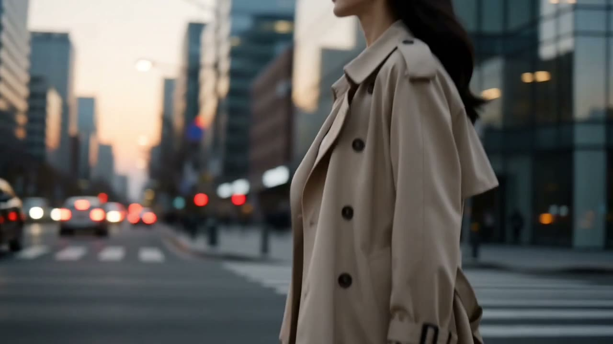](https://ark-common-storage-prod-cn-beijing.tos-cn-beijing.volces.com/presets/experience/gen_video/model-promotion/seedance-2-5/part1/tab2/group1/reference2.mp4)

[Video abspielen](https://ark-common-storage-prod-cn-beijing.tos-cn-beijing.volces.com/presets/experience/gen_video/model-promotion/seedance-2-5/part1/tab2/group1/reference2.mp4) · Klicke auf das Thumbnail, um das Video abzuspielen.

**Referenz-Assets:** 17

**Prompt:**

```text
Kernanweisungen: Ein 26-sekündiger One-Shot-Erzählkurzfilm mit stabiler Verfolgung und Verflechtung, siehe<<<video_1_1>>>, und sanfter Surround-Bewegung, siehe<<<video_2_2>>>. Sanftes Reisegefühl. Der Wechsel von Tag und Nacht und der Verlauf der vier Jahreszeiten werden im Objektiv verwirklicht. Die Protagonistin ist eine europäische Frau<<<image_1_3>>>, platziert in einem Meer von Menschen voller Feuerwerkskörper, was das ultimative Gefühl der Einsamkeit und die Qualität der Kinematographie hervorhebt.
Segmentierte Kamerabewegung und Szenenbeschreibung:
0-3 Sekunden (glatte Rückseite): Die alte Holztür<<<image_2_4>>>öffnet sich mit einem Knarren, und die Kamera folgt der Gestalt einer Europäerin, die<<<image_3_5>>>trägt und hinausgeht. An der Schwelle blieb er kurz stehen. Die Straßen vor uns waren mit Licht und Schatten gesprenkelt, und die Geräusche von Feilschen und Menschenmassen näherten sich. Sie wirkte distanziert und ging langsam auf die Straße.
3-6 Sekunden (Rückwärts- und Seitenkamerafahrt): Die Kamera folgt sanft, sie betritt den überfüllten Morgenmarkt, die Atmosphäre bezieht sich auf<<<video_3_6>>>. Auf beiden Seiten drängten sich bunte Obststände und Gewürzläden, und eine Gruppe Straßenjongleure spuckten Feuerdrachen, siehe<<<image_4_7>>>. Der Feuerschein beleuchtete die Menge, aber sie blinzelte nicht und ging in gleichmäßigem Tempo hindurch.
6–9 Sekunden (Smooth Surround von der Seite): Die Kamera beginnt, sich sanft zur Seite und nach vorne zu bewegen und das Seitengesicht des Protagonisten einzufangen. Sie ging an der lauten Metzgerei<<<image_5_8>>>vorbei, und eine junge Mutter ging an ihm vorbei und hielt ein Baby<<<image_6_9>>>in der Hand. Das Baby starrte sie neugierig an, aber sie senkte nur leicht den Blick, um nicht hinzusehen, ohne überhaupt innezuhalten.
9-12 Sekunden (Vorwärts- und Rückwärts-Nachfolgeaufnahme): Die Kamera kreist weiterhin direkt vor dem Protagonisten und führt eine Rückwärts- und Nachfolgeaufnahme durch. Die Menge vor ihnen zog sich plötzlich auf natürliche Weise nach beiden Seiten zurück, so wie Moses das Meer teilte. Ein riesiger Elefant<<<image_7_10>>>, bedeckt mit wunderschönem roten Stoff, erschien mit gleichmäßigem Tempo auf der rechten Seite des Bildschirms und nahm den größten Teil des Bildschirms ein.
12-15 Sekunden (Lückendurchdringung und Zurückspulen): In dem Moment, in dem die Frau und der Elefant zusammenstoßen, gleitet die Kamera geschickt durch die enge Lücke zwischen dem Elefanten und der Frau und zirkuliert zurück zu ihrem Rücken. Die Elefanten zogen gewaltig und lautlos vorbei, und die Bengel jagten ihnen voller Freude nach. Wie Glocken und Gelächter wurde sie nicht einmal langsamer.
15–18 Sekunden (Umgebungslicht- und Schattenverlauf): Während sie geht, verändern sich Licht und Schatten in der Totalen auf magische Weise – das blendende Sonnenlicht im Hochsommer wird augenblicklich weicher, eine Brise rollt die goldenen Blätter<<<video_2_2>>>0 am Himmel auf und die Jahreszeit geht in derselben Totalen nahtlos in den Spätherbst über. Abgefallenes Laub streifte ihre Schultern.
18–21 Sekunden (immersiver 360-Grad-Surround): Die Front fällt plötzlich in ein großes Straßenfest<<<video_2_2>>>1. Bunte Bänder und Papierschnitzel flogen in die Luft, und die Verkäufer beugten sich zum Jubeln hinaus. In diesem Moment entfaltet die Kamera eine kontinuierliche 360-Grad-Schwenkbewegung, wodurch ein äußerst starker visueller Riss zwischen dem stillen und einsamen Protagonisten und der hektischen Umgebung entsteht.
21-24 Sekunden (zurück zur Seite und zurück kreisend): Als die Kamera umkreiste und zu ihrer Seite und zurück zurückkehrte, hatten sich die fallenden Bänder am ganzen Himmel still und leise in Schnee verwandelt – es war augenblicklich Winter<<<video_2_2>>>2. Fußgänger hielten Regenschirme hoch oder setzten Kapuzen auf, und Frauen schrumpften leicht, schlugen ihre Mantelkragen hoch, verwandelten sich in<<<video_2_2>>>3 und gingen allein im Schnee weiter.
24–26 Sekunden (langsames Drücken und Schlagen): Als sie sich dem Ende der langen Straße näherte, verdunkelte sich der Himmel mit einer Geschwindigkeit, die mit bloßem Auge sichtbar war, und der Tag ging nahtlos in die Nacht über. Die gedämpften Straßenlaternen auf beiden Seiten und die Glühbirnen der Stände wurden nacheinander eingeschaltet<<<video_2_2>>>4. Die Verkäufer packten ihre Waren ein. Der Lärm schien durch den starken Schnee langsam absorbiert und entfernt zu werden, und ihre Schritte wurden allmählich langsamer. Plötzlich erblühte ein großes Feuerwerk am Nachthimmel<<<video_2_2>>>5, das Geräusch des aufblühenden Feuerwerks bezieht sich auf<<<video_2_2>>>6. Bunte Lichtpunkte flackerten und sprangen an den Gebäudewänden und in ihre Augen. Die Welt ist immer noch lebendig, aber sie schaut ruhig nach oben, die Kamera zoomt langsam heraus und endet hier sanft.
```

> [!NOTE]
> Dieser offizielle Case enthält außerdem Referenz-Assets im Manifest.

---

### Case 19: Die Grenzen der Erzählung sprengen – mehr Referenzeingaben – Referenzvideo-1-6

[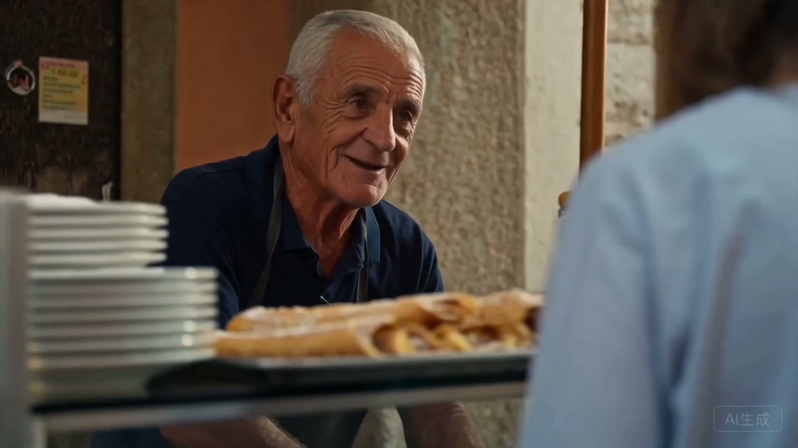](https://ark-common-storage-prod-cn-beijing.tos-cn-beijing.volces.com/presets/experience/gen_video/model-promotion/seedance-2-5/part1/tab2/group1/reference6.mp4)

[Video abspielen](https://ark-common-storage-prod-cn-beijing.tos-cn-beijing.volces.com/presets/experience/gen_video/model-promotion/seedance-2-5/part1/tab2/group1/reference6.mp4) · Klicke auf das Thumbnail, um das Video abzuspielen.

**Referenz-Assets:** 17

**Prompt:**

```text
Kernanweisungen: Ein 26-sekündiger One-Shot-Erzählkurzfilm mit stabiler Verfolgung und Verflechtung, siehe<<<video_1_1>>>, und sanfter Surround-Bewegung, siehe<<<video_2_2>>>. Sanftes Reisegefühl. Der Wechsel von Tag und Nacht und der Verlauf der vier Jahreszeiten werden im Objektiv verwirklicht. Die Protagonistin ist eine europäische Frau<<<image_1_3>>>, platziert in einem Meer von Menschen voller Feuerwerkskörper, was das ultimative Gefühl der Einsamkeit und die Qualität der Kinematographie hervorhebt.
Segmentierte Kamerabewegung und Szenenbeschreibung:
0-3 Sekunden (glatte Rückseite): Die alte Holztür<<<image_2_4>>>öffnet sich mit einem Knarren, und die Kamera folgt der Gestalt einer Europäerin, die<<<image_3_5>>>trägt und hinausgeht. An der Schwelle blieb er kurz stehen. Die Straßen vor uns waren mit Licht und Schatten gesprenkelt, und die Geräusche von Feilschen und Menschenmassen näherten sich. Sie wirkte distanziert und ging langsam auf die Straße.
3-6 Sekunden (Rückwärts- und Seitenkamerafahrt): Die Kamera folgt sanft, sie betritt den überfüllten Morgenmarkt, die Atmosphäre bezieht sich auf<<<video_3_6>>>. Auf beiden Seiten drängten sich bunte Obststände und Gewürzläden, und eine Gruppe Straßenjongleure spuckten Feuerdrachen, siehe<<<image_4_7>>>. Der Feuerschein beleuchtete die Menge, aber sie blinzelte nicht und ging in gleichmäßigem Tempo hindurch.
6–9 Sekunden (Smooth Surround von der Seite): Die Kamera beginnt, sich sanft zur Seite und nach vorne zu bewegen und das Seitengesicht des Protagonisten einzufangen. Sie ging an der lauten Metzgerei<<<image_5_8>>>vorbei, und eine junge Mutter ging an ihm vorbei und hielt ein Baby<<<image_6_9>>>in der Hand. Das Baby starrte sie neugierig an, aber sie senkte nur leicht den Blick, um nicht hinzusehen, ohne überhaupt innezuhalten.
9-12 Sekunden (Vorwärts- und Rückwärts-Nachfolgeaufnahme): Die Kamera kreist weiterhin direkt vor dem Protagonisten und führt eine Rückwärts- und Nachfolgeaufnahme durch. Die Menge vor ihnen zog sich plötzlich auf natürliche Weise nach beiden Seiten zurück, so wie Moses das Meer teilte. Ein riesiger Elefant<<<image_7_10>>>, bedeckt mit wunderschönem roten Stoff, erschien mit gleichmäßigem Tempo auf der rechten Seite des Bildschirms und nahm den größten Teil des Bildschirms ein.
12-15 Sekunden (Lückendurchdringung und Zurückspulen): In dem Moment, in dem die Frau und der Elefant zusammenstoßen, gleitet die Kamera geschickt durch die enge Lücke zwischen dem Elefanten und der Frau und zirkuliert zurück zu ihrem Rücken. Die Elefanten zogen gewaltig und lautlos vorbei, und die Bengel jagten ihnen voller Freude nach. Wie Glocken und Gelächter wurde sie nicht einmal langsamer.
15–18 Sekunden (Umgebungslicht- und Schattenverlauf): Während sie geht, verändern sich Licht und Schatten in der Totalen auf magische Weise – das blendende Sonnenlicht im Hochsommer wird augenblicklich weicher, eine Brise rollt die goldenen Blätter<<<video_2_2>>>0 am Himmel auf und die Jahreszeit geht in derselben Totalen nahtlos in den Spätherbst über. Abgefallenes Laub streifte ihre Schultern.
18–21 Sekunden (immersiver 360-Grad-Surround): Die Front fällt plötzlich in ein großes Straßenfest<<<video_2_2>>>1. Bunte Bänder und Papierschnitzel flogen in die Luft, und die Verkäufer beugten sich zum Jubeln hinaus. In diesem Moment entfaltet die Kamera eine kontinuierliche 360-Grad-Schwenkbewegung, wodurch ein äußerst starker visueller Riss zwischen dem stillen und einsamen Protagonisten und der hektischen Umgebung entsteht.
21-24 Sekunden (zurück zur Seite und zurück kreisend): Als die Kamera umkreiste und zu ihrer Seite und zurück zurückkehrte, hatten sich die fallenden Bänder am ganzen Himmel still und leise in Schnee verwandelt – es war augenblicklich Winter<<<video_2_2>>>2. Fußgänger hielten Regenschirme hoch oder setzten Kapuzen auf, und Frauen schrumpften leicht, schlugen ihre Mantelkragen hoch, verwandelten sich in<<<video_2_2>>>3 und gingen allein im Schnee weiter.
24–26 Sekunden (langsames Drücken und Schlagen): Als sie sich dem Ende der langen Straße näherte, verdunkelte sich der Himmel mit einer Geschwindigkeit, die mit bloßem Auge sichtbar war, und der Tag ging nahtlos in die Nacht über. Die gedämpften Straßenlaternen auf beiden Seiten und die Glühbirnen der Stände wurden nacheinander eingeschaltet<<<video_2_2>>>4. Die Verkäufer packten ihre Waren ein. Der Lärm schien durch den starken Schnee langsam absorbiert und entfernt zu werden, und ihre Schritte wurden allmählich langsamer. Plötzlich erblühte ein großes Feuerwerk am Nachthimmel<<<video_2_2>>>5, das Geräusch des aufblühenden Feuerwerks bezieht sich auf<<<video_2_2>>>6. Bunte Lichtpunkte flackerten und sprangen an den Gebäudewänden und in ihre Augen. Die Welt ist immer noch lebendig, aber sie schaut ruhig nach oben, die Kamera zoomt langsam heraus und endet hier sanft.
```

> [!NOTE]
> Dieser offizielle Case enthält außerdem Referenz-Assets im Manifest.

---

### Case 20: Narrative Grenzen verschieben – Mehr Referenz-Input-Output-2

[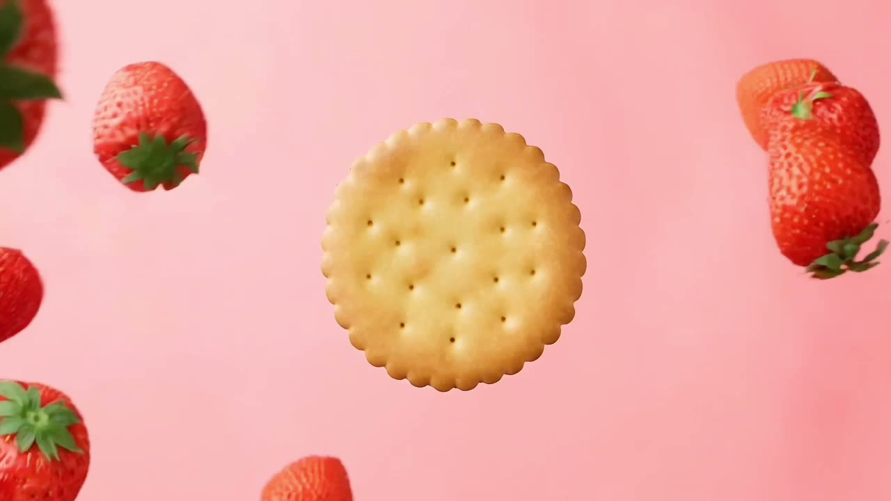](https://ark-common-storage-prod-cn-beijing.tos-cn-beijing.volces.com/presets/experience/gen_video/model-promotion/seedance-2-5/part1/tab2/group2/output.mp4)

[Video abspielen](https://ark-common-storage-prod-cn-beijing.tos-cn-beijing.volces.com/presets/experience/gen_video/model-promotion/seedance-2-5/part1/tab2/group2/output.mp4) · Klicke auf das Thumbnail, um das Video abzuspielen.

**Referenz-Assets:** 7

**Prompt:**

```text
Der Stil des Werbespots ist hell und farbenfroh, mit fruchtigen Keksen als Protagonisten, darunter vier Geschmacksrichtungen: Erdbeere, Apfel, Traube und Orange. Der Erdbeergeschmack bezieht sich auf<<<image_1_1>>>. Die Kekse und die dazugehörigen Früchte sind in einer geometrischen Anordnung mit ausgeprägtem Sinn für Ordnung angeordnet. Das Gesamtbild ist klar, fortschrittlich und rhythmisch. Die Eröffnungsfrucht stellt schnell den visuellen Fokus her und verweist auf die Komposition von<<<video_1_2>>>, und die Musik wird neu geschlagen. Anschließend werden die Kekse verschiedener Geschmacksrichtungen fein säuberlich arrangiert und in Nahaufnahmen geschnitten, in Anlehnung an die Dynamik und Kamerabewegungen von<<<video_2_3>>>. Während des Höhepunkts wird ein Keks zerbrochen und sofort geht es in Zeitlupe über. Das fruchtige Sandwich explodiert, Krümel fliegen herum und der Aufprall von Saft und Partikeln wird vergrößert und angezeigt. Beachten Sie die Auswirkungen von<<<video_3_4>>>. Die horizontale Anordnung bildet eine rhythmische Parabel, die auf die Bewegung von<<<video_4_5>>>verweist und die Schönheit der Ordnung und Produktvielfalt hervorhebt. Dann schnell zurück zur rasanten Bearbeitung. Der abschließende englische Text „Ein Bissen Knusprigkeit, ein Herz voller Freude“ wird schnell ins Bild geschaltet, kombiniert mit der starken rhythmischen Textbewegung und dem Produkt-Standbild, siehe<<<video_5_6>>>, und schließlich wird der Markensinn verpackt, und die Kekse und Früchte werden in alle Richtungen ausgebreitet, siehe<<<video_6_7>>>. Das Bild ist voller junger, energischer, köstlicher und werblicher Atmosphäre.
```

> [!NOTE]
> Dieser offizielle Case enthält außerdem Referenz-Assets im Manifest.

---

### Case 21: Die Grenzen der Erzählung durchbrechen – mehr Referenzeingaben – Referenzvideo-2-2

[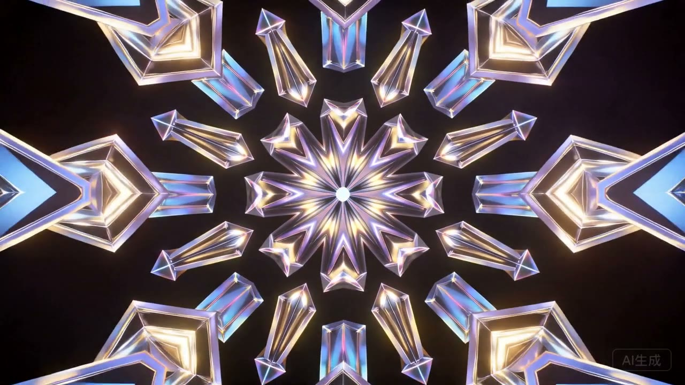](https://ark-common-storage-prod-cn-beijing.tos-cn-beijing.volces.com/presets/experience/gen_video/model-promotion/seedance-2-5/part1/tab2/group2/reference2.mp4)

[Video abspielen](https://ark-common-storage-prod-cn-beijing.tos-cn-beijing.volces.com/presets/experience/gen_video/model-promotion/seedance-2-5/part1/tab2/group2/reference2.mp4) · Klicke auf das Thumbnail, um das Video abzuspielen.

**Referenz-Assets:** 7

**Prompt:**

```text
Der Stil des Werbespots ist hell und farbenfroh, mit fruchtigen Keksen als Protagonisten, darunter vier Geschmacksrichtungen: Erdbeere, Apfel, Traube und Orange. Der Erdbeergeschmack bezieht sich auf<<<image_1_1>>>. Die Kekse und die dazugehörigen Früchte sind in einer geometrischen Anordnung mit ausgeprägtem Sinn für Ordnung angeordnet. Das Gesamtbild ist klar, fortschrittlich und rhythmisch. Die Eröffnungsfrucht stellt schnell den visuellen Fokus her und verweist auf die Komposition von<<<video_1_2>>>, und die Musik wird neu geschlagen. Anschließend werden die Kekse verschiedener Geschmacksrichtungen fein säuberlich arrangiert und in Nahaufnahmen geschnitten, in Anlehnung an die Dynamik und Kamerabewegungen von<<<video_2_3>>>. Während des Höhepunkts wird ein Keks zerbrochen und sofort geht es in Zeitlupe über. Das fruchtige Sandwich explodiert, Krümel fliegen herum und der Aufprall von Saft und Partikeln wird vergrößert und angezeigt. Beachten Sie die Auswirkungen von<<<video_3_4>>>. Die horizontale Anordnung bildet eine rhythmische Parabel, die auf die Bewegung von<<<video_4_5>>>verweist und die Schönheit der Ordnung und Produktvielfalt hervorhebt. Dann schnell zurück zur rasanten Bearbeitung. Der abschließende englische Text „Ein Bissen Knusprigkeit, ein Herz voller Freude“ wird schnell ins Bild geschaltet, kombiniert mit der starken rhythmischen Textbewegung und dem Produkt-Standbild, siehe<<<video_5_6>>>, und schließlich wird der Markensinn verpackt, und die Kekse und Früchte werden in alle Richtungen ausgebreitet, siehe<<<video_6_7>>>. Das Bild ist voller junger, energischer, köstlicher und werblicher Atmosphäre.
```

> [!NOTE]
> Dieser offizielle Case enthält außerdem Referenz-Assets im Manifest.

---

### Case 22: Die Grenzen der Erzählung sprengen – mehr Referenzeingaben – Referenzvideo-2-3

[](https://ark-common-storage-prod-cn-beijing.tos-cn-beijing.volces.com/presets/experience/gen_video/model-promotion/seedance-2-5/part1/tab2/group2/reference3.mp4)

[Video abspielen](https://ark-common-storage-prod-cn-beijing.tos-cn-beijing.volces.com/presets/experience/gen_video/model-promotion/seedance-2-5/part1/tab2/group2/reference3.mp4) · Klicke auf das Thumbnail, um das Video abzuspielen.

**Referenz-Assets:** 7

**Prompt:**

```text
Der Stil des Werbespots ist hell und farbenfroh, mit fruchtigen Keksen als Protagonisten, darunter vier Geschmacksrichtungen: Erdbeere, Apfel, Traube und Orange. Der Erdbeergeschmack bezieht sich auf<<<image_1_1>>>. Die Kekse und die dazugehörigen Früchte sind in einer geometrischen Anordnung mit ausgeprägtem Sinn für Ordnung angeordnet. Das Gesamtbild ist klar, fortschrittlich und rhythmisch. Die Eröffnungsfrucht stellt schnell den visuellen Fokus her und verweist auf die Komposition von<<<video_1_2>>>, und die Musik wird neu geschlagen. Anschließend werden die Kekse verschiedener Geschmacksrichtungen fein säuberlich arrangiert und in Nahaufnahmen geschnitten, in Anlehnung an die Dynamik und Kamerabewegungen von<<<video_2_3>>>. Während des Höhepunkts wird ein Keks zerbrochen und sofort geht es in Zeitlupe über. Das fruchtige Sandwich explodiert, Krümel fliegen herum und der Aufprall von Saft und Partikeln wird vergrößert und angezeigt. Beachten Sie die Auswirkungen von<<<video_3_4>>>. Die horizontale Anordnung bildet eine rhythmische Parabel, die auf die Bewegung von<<<video_4_5>>>verweist und die Schönheit der Ordnung und Produktvielfalt hervorhebt. Dann schnell zurück zur rasanten Bearbeitung. Der abschließende englische Text „Ein Bissen Knusprigkeit, ein Herz voller Freude“ wird schnell ins Bild geschaltet, kombiniert mit der starken rhythmischen Textbewegung und dem Produkt-Standbild, siehe<<<video_5_6>>>, und schließlich wird der Markensinn verpackt, und die Kekse und Früchte werden in alle Richtungen ausgebreitet, siehe<<<video_6_7>>>. Das Bild ist voller junger, energischer, köstlicher und werblicher Atmosphäre.
```

> [!NOTE]
> Dieser offizielle Case enthält außerdem Referenz-Assets im Manifest.

---

### Case 23: Die Grenzen der Erzählung sprengen – mehr Referenzeingaben – Referenzvideo-2-4

[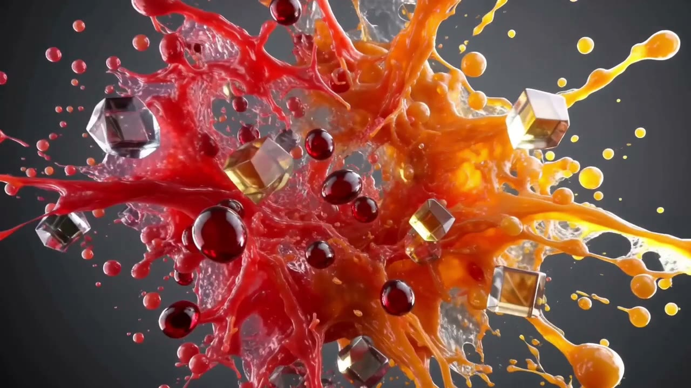](https://ark-common-storage-prod-cn-beijing.tos-cn-beijing.volces.com/presets/experience/gen_video/model-promotion/seedance-2-5/part1/tab2/group2/reference4.mp4)

[Video abspielen](https://ark-common-storage-prod-cn-beijing.tos-cn-beijing.volces.com/presets/experience/gen_video/model-promotion/seedance-2-5/part1/tab2/group2/reference4.mp4) · Klicke auf das Thumbnail, um das Video abzuspielen.

**Referenz-Assets:** 7

**Prompt:**

```text
Der Stil des Werbespots ist hell und farbenfroh, mit fruchtigen Keksen als Protagonisten, darunter vier Geschmacksrichtungen: Erdbeere, Apfel, Traube und Orange. Der Erdbeergeschmack bezieht sich auf<<<image_1_1>>>. Die Kekse und die dazugehörigen Früchte sind in einer geometrischen Anordnung mit ausgeprägtem Sinn für Ordnung angeordnet. Das Gesamtbild ist klar, fortschrittlich und rhythmisch. Die Eröffnungsfrucht stellt schnell den visuellen Fokus her und verweist auf die Komposition von<<<video_1_2>>>, und die Musik wird neu geschlagen. Anschließend werden die Kekse verschiedener Geschmacksrichtungen fein säuberlich arrangiert und in Nahaufnahmen geschnitten, in Anlehnung an die Dynamik und Kamerabewegungen von<<<video_2_3>>>. Während des Höhepunkts wird ein Keks zerbrochen und sofort geht es in Zeitlupe über. Das fruchtige Sandwich explodiert, Krümel fliegen herum und der Aufprall von Saft und Partikeln wird vergrößert und angezeigt. Beachten Sie die Auswirkungen von<<<video_3_4>>>. Die horizontale Anordnung bildet eine rhythmische Parabel, die auf die Bewegung von<<<video_4_5>>>verweist und die Schönheit der Ordnung und Produktvielfalt hervorhebt. Dann schnell zurück zur rasanten Bearbeitung. Der abschließende englische Text „Ein Bissen Knusprigkeit, ein Herz voller Freude“ wird schnell ins Bild geschaltet, kombiniert mit der starken rhythmischen Textbewegung und dem Produkt-Standbild, siehe<<<video_5_6>>>, und schließlich wird der Markensinn verpackt, und die Kekse und Früchte werden in alle Richtungen ausgebreitet, siehe<<<video_6_7>>>. Das Bild ist voller junger, energischer, köstlicher und werblicher Atmosphäre.
```

> [!NOTE]
> Dieser offizielle Case enthält außerdem Referenz-Assets im Manifest.

---

### Case 24: Die Grenzen der Erzählung durchbrechen – mehr Referenzeingaben – Referenzvideo-2-5

[](https://ark-common-storage-prod-cn-beijing.tos-cn-beijing.volces.com/presets/experience/gen_video/model-promotion/seedance-2-5/part1/tab2/group2/reference5.mp4)

[Video abspielen](https://ark-common-storage-prod-cn-beijing.tos-cn-beijing.volces.com/presets/experience/gen_video/model-promotion/seedance-2-5/part1/tab2/group2/reference5.mp4) · Klicke auf das Thumbnail, um das Video abzuspielen.

**Referenz-Assets:** 7

**Prompt:**

```text
Der Stil des Werbespots ist hell und farbenfroh, mit fruchtigen Keksen als Protagonisten, darunter vier Geschmacksrichtungen: Erdbeere, Apfel, Traube und Orange. Der Erdbeergeschmack bezieht sich auf<<<image_1_1>>>. Die Kekse und die dazugehörigen Früchte sind in einer geometrischen Anordnung mit ausgeprägtem Sinn für Ordnung angeordnet. Das Gesamtbild ist klar, fortschrittlich und rhythmisch. Die Eröffnungsfrucht stellt schnell den visuellen Fokus her und verweist auf die Komposition von<<<video_1_2>>>, und die Musik wird neu geschlagen. Anschließend werden die Kekse verschiedener Geschmacksrichtungen fein säuberlich arrangiert und in Nahaufnahmen geschnitten, in Anlehnung an die Dynamik und Kamerabewegungen von<<<video_2_3>>>. Während des Höhepunkts wird ein Keks zerbrochen und sofort geht es in Zeitlupe über. Das fruchtige Sandwich explodiert, Krümel fliegen herum und der Aufprall von Saft und Partikeln wird vergrößert und angezeigt. Beachten Sie die Auswirkungen von<<<video_3_4>>>. Die horizontale Anordnung bildet eine rhythmische Parabel, die auf die Bewegung von<<<video_4_5>>>verweist und die Schönheit der Ordnung und Produktvielfalt hervorhebt. Dann schnell zurück zur rasanten Bearbeitung. Der abschließende englische Text „Ein Bissen Knusprigkeit, ein Herz voller Freude“ wird schnell ins Bild geschaltet, kombiniert mit der starken rhythmischen Textbewegung und dem Produkt-Standbild, siehe<<<video_5_6>>>, und schließlich wird der Markensinn verpackt, und die Kekse und Früchte werden in alle Richtungen ausgebreitet, siehe<<<video_6_7>>>. Das Bild ist voller junger, energischer, köstlicher und werblicher Atmosphäre.
```

> [!NOTE]
> Dieser offizielle Case enthält außerdem Referenz-Assets im Manifest.

---

### Case 25: Die Grenzen der Erzählung sprengen – mehr Referenzeingaben – Referenzvideo-2-6

[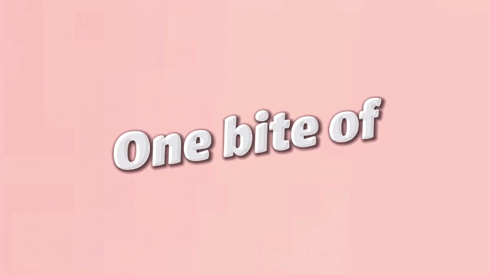](https://ark-common-storage-prod-cn-beijing.tos-cn-beijing.volces.com/presets/experience/gen_video/model-promotion/seedance-2-5/part1/tab2/group2/reference6.mp4)

[Video abspielen](https://ark-common-storage-prod-cn-beijing.tos-cn-beijing.volces.com/presets/experience/gen_video/model-promotion/seedance-2-5/part1/tab2/group2/reference6.mp4) · Klicke auf das Thumbnail, um das Video abzuspielen.

**Referenz-Assets:** 7

**Prompt:**

```text
Der Stil des Werbespots ist hell und farbenfroh, mit fruchtigen Keksen als Protagonisten, darunter vier Geschmacksrichtungen: Erdbeere, Apfel, Traube und Orange. Der Erdbeergeschmack bezieht sich auf<<<image_1_1>>>. Die Kekse und die dazugehörigen Früchte sind in einer geometrischen Anordnung mit ausgeprägtem Sinn für Ordnung angeordnet. Das Gesamtbild ist klar, fortschrittlich und rhythmisch. Die Eröffnungsfrucht stellt schnell den visuellen Fokus her und verweist auf die Komposition von<<<video_1_2>>>, und die Musik wird neu geschlagen. Anschließend werden die Kekse verschiedener Geschmacksrichtungen fein säuberlich arrangiert und in Nahaufnahmen geschnitten, in Anlehnung an die Dynamik und Kamerabewegungen von<<<video_2_3>>>. Während des Höhepunkts wird ein Keks zerbrochen und sofort geht es in Zeitlupe über. Das fruchtige Sandwich explodiert, Krümel fliegen herum und der Aufprall von Saft und Partikeln wird vergrößert und angezeigt. Beachten Sie die Auswirkungen von<<<video_3_4>>>. Die horizontale Anordnung bildet eine rhythmische Parabel, die auf die Bewegung von<<<video_4_5>>>verweist und die Schönheit der Ordnung und Produktvielfalt hervorhebt. Dann schnell zurück zur rasanten Bearbeitung. Der abschließende englische Text „Ein Bissen Knusprigkeit, ein Herz voller Freude“ wird schnell ins Bild geschaltet, kombiniert mit der starken rhythmischen Textbewegung und dem Produkt-Standbild, siehe<<<video_5_6>>>, und schließlich wird der Markensinn verpackt, und die Kekse und Früchte werden in alle Richtungen ausgebreitet, siehe<<<video_6_7>>>. Das Bild ist voller junger, energischer, köstlicher und werblicher Atmosphäre.
```

> [!NOTE]
> Dieser offizielle Case enthält außerdem Referenz-Assets im Manifest.

---

### Case 26: Die Grenzen der Erzählung durchbrechen – mehr Referenzeingaben – Referenzvideo-2-7

[](https://ark-common-storage-prod-cn-beijing.tos-cn-beijing.volces.com/presets/experience/gen_video/model-promotion/seedance-2-5/part1/tab2/group2/reference7.mp4)

[Video abspielen](https://ark-common-storage-prod-cn-beijing.tos-cn-beijing.volces.com/presets/experience/gen_video/model-promotion/seedance-2-5/part1/tab2/group2/reference7.mp4) · Klicke auf das Thumbnail, um das Video abzuspielen.

**Referenz-Assets:** 7

**Prompt:**

```text
Der Stil des Werbespots ist hell und farbenfroh, mit fruchtigen Keksen als Protagonisten, darunter vier Geschmacksrichtungen: Erdbeere, Apfel, Traube und Orange. Der Erdbeergeschmack bezieht sich auf<<<image_1_1>>>. Die Kekse und die dazugehörigen Früchte sind in einer geometrischen Anordnung mit ausgeprägtem Sinn für Ordnung angeordnet. Das Gesamtbild ist klar, fortschrittlich und rhythmisch. Die Eröffnungsfrucht stellt schnell den visuellen Fokus her und verweist auf die Komposition von<<<video_1_2>>>, und die Musik wird neu geschlagen. Anschließend werden die Kekse verschiedener Geschmacksrichtungen fein säuberlich arrangiert und in Nahaufnahmen geschnitten, in Anlehnung an die Dynamik und Kamerabewegungen von<<<video_2_3>>>. Während des Höhepunkts wird ein Keks zerbrochen und sofort geht es in Zeitlupe über. Das fruchtige Sandwich explodiert, Krümel fliegen herum und der Aufprall von Saft und Partikeln wird vergrößert und angezeigt. Beachten Sie die Auswirkungen von<<<video_3_4>>>. Die horizontale Anordnung bildet eine rhythmische Parabel, die auf die Bewegung von<<<video_4_5>>>verweist und die Schönheit der Ordnung und Produktvielfalt hervorhebt. Dann schnell zurück zur rasanten Bearbeitung. Der abschließende englische Text „Ein Bissen Knusprigkeit, ein Herz voller Freude“ wird schnell ins Bild geschaltet, kombiniert mit der starken rhythmischen Textbewegung und dem Produkt-Standbild, siehe<<<video_5_6>>>, und schließlich wird der Markensinn verpackt, und die Kekse und Früchte werden in alle Richtungen ausgebreitet, siehe<<<video_6_7>>>. Das Bild ist voller junger, energischer, köstlicher und werblicher Atmosphäre.
```

> [!NOTE]
> Dieser offizielle Case enthält außerdem Referenz-Assets im Manifest.

---

### Case 27: Durchbrechen der Grenzen von Narrativ-Bildschirmsteuerung-Ausgabe-1 der zweiten Ebene

[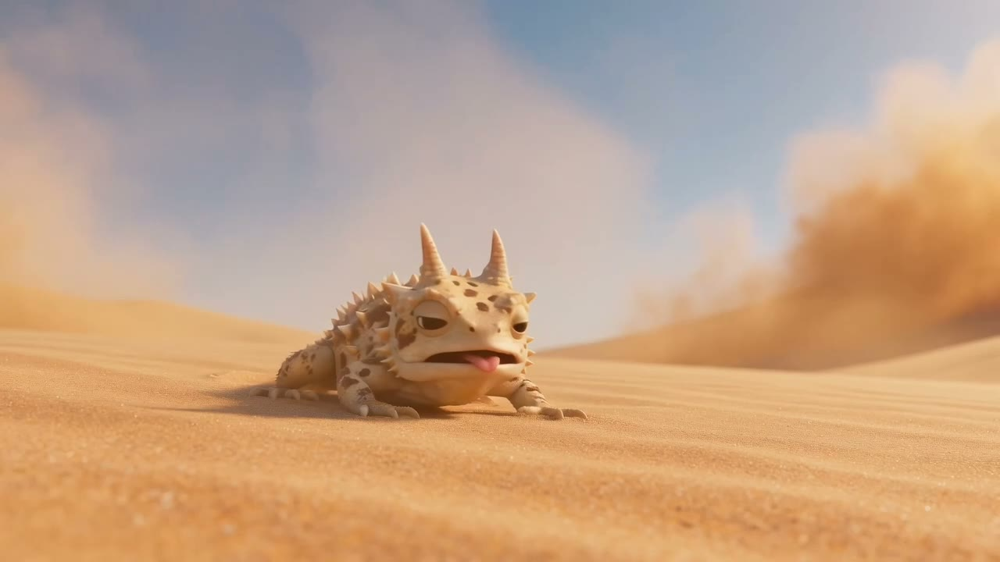](https://ark-common-storage-prod-cn-beijing.tos-cn-beijing.volces.com/presets/experience/gen_video/model-promotion/seedance-2-5/part1/tab3/group1/output.mp4)

[Video abspielen](https://ark-common-storage-prod-cn-beijing.tos-cn-beijing.volces.com/presets/experience/gen_video/model-promotion/seedance-2-5/part1/tab3/group1/output.mp4) · Klicke auf das Thumbnail, um das Video abzuspielen.

**Referenz-Assets:** 1

**Prompt:**

```text
3D-Animationswerbestil, helle und transparente Farben sowie Fruchtfleisch und Saft sollten ein starkes Gefühl von Erfrischung und Wirkung haben. Das Gesamttemperament ähnelt einem hochwertigen kommerziellen Animationskurzfilm mit etwas übertriebenem Humor. Die Figur der Wüstengehörntenechse ist süß, klug und ausdrucksstark. Bitte beziehen Sie sich auf<<<image_1_1>>>. Die Textur des Bildes bezieht sich auf das weiche natürliche Licht, die feine Flaum-/Hautstruktur, die verträumte Makro-Tiefenschärfe und ein wirklich kindliches Gefühl im Bild.
0-3 Sekunden: Das Bild zeigt eine Wüste, die der sengenden Sonne ausgesetzt ist. Die Luft war durch die Hitze verzerrt, der Sand war heiß und in der Ferne schien Rauch aufzusteigen. Eine Wüstengehörnechse lag im heißen Sand, ihre Zunge hing leicht heraus, ihre Augen waren unscharf und trocknete in der Sonne fast aus. Es machte zwei Schritte und schwankte, und die gesamte Wüstengehörnteidechse war kurz davor, zu „verdampfen“.
Zu den Soundeffekten gehören das Surren von Hitzewellen und ein leicht übertriebenes, trockenes Knistern.
3-6 Sekunden: Die Wüstengehörnteidechse bleibt plötzlich stehen und bewegt ihre Nase. Es schaute nach unten und sah eine kalte, pralle Grapefruit mit im Sand vergrabenen Wassertropfen. Die Grapefruit glänzt hell in der Sonne, mit zarter Schale, wie ein Wunder, das plötzlich in der Wüste auftauchte.
Die Augen der darstellenden Eidechse weiteten sich augenblicklich, als würde sie einen lebensrettenden Strohhalm sehen.
Der Soundeffekt „Ding“ ist ein Entdeckungssoundeffekt.
6-8 Sekunden: Die Wüstengehörnteidechse stürzt herbei, umarmt die Grapefruit mit beiden Händen und drückt ihr ganzes Gesicht gegen die Schale. Es hat einen fröhlichen Ausdruck von „endlich lebendig“. Das Bild friert für eine Sekunde ein und bildet so einen übertriebenen und lustigen Werbeerinnerungspunkt.
Der Soundeffekt ploppte und verstummte dann für eine halbe Sekunde.
Sekunden 8–11: Screenshot einer Wüstenechse, die sich eine Grapefruit schnappt. Die Grapefruitschale ist aufgeplatzt und das pralle Fruchtfleisch im Inneren glänzt durchscheinend. Im nächsten Moment floss der Saft nicht heraus, sondern spritzte wie ein Tsunami heraus.
Der Soundeffekt ist ein „Klick“-Geräusch beim Aufbeißen, gefolgt von einem übertriebenen Geräusch platzenden Safts.
11-16 Sekunden: Auf dem Bildschirm ist zu sehen, wie orange-rosafarbener, klarer und glänzender Grapefruitsaft wie verrückt herausströmt, die Sanddünen hinunterströmt und schnell die gesamte Wüste überschwemmt. Der trockene gelbe Sand verwandelt sich sofort in ein kühles, glitzerndes, fruchtiges Sommermeer. Die Kakteen, Steine ​​und kleinen Sanddünen in der Wüste werden von den Saftwellen verschlungen und das Bild ist übertrieben und verträumt.
Der Auftritt der Wüstengehörntenechse war zunächst sehr aufregend, aber in der nächsten Sekunde wurde mir klar, dass etwas nicht stimmte, und mein Gesichtsausdruck änderte sich von Überraschung zu Entsetzen.
16-20 Sekunden: Die Wüstengehörnteidechse ist fast im „Grapefruitmeer“ versunken. Es umarmt hastig die Hälfte der Grapefruit und schwimmt wie ein Rettungsring auf dem Meer. Es streckte nass und verwirrt den Kopf heraus. Die Meeresoberfläche glitzert, die Farbe ist wie von der Sonne beleuchteter Saft.
Die Soundeffekte übertreiben das Flattern und Wellengeräusch mit einem Hauch von Komik.
20–23 Sekunden: Der Bildschirm wird plötzlich weiß. Der Markenname und der Slogan erschienen in der Mitte des Bildschirms: „Seedance Grapefruit, was man hineinbeißt, ist das Fruchtfleisch, was herauskommt, ist Sommer.“
Der Erzähler liest den gesamten Satz: „Seedance Grapefruit, was man hineinbeißt, ist das Fruchtfleisch, was herauskommt, ist Sommer.“
Markenton mit sauberem und erfrischendem Klang.
23–29 Sekunden: Der Bildschirm wechselt zurück zum weißen Bildschirm. Die Wüstengehörnteidechse sitzt bereits gemächlich auf einer schwimmenden Grapefruit, trägt eine kleine Sonnenbrille, hält einen Trinkbecher in der Hand und treibt langsam auf dem „Saftmeer“ in den Urlaub. Orangefarbenes Fruchtfleisch, kleine Eiswürfel und kühle Wasserspritzer schwammen herum, der Himmel wurde blau und die Atmosphäre änderte sich plötzlich von „Überleben“ zu „Urlaub“. Am Ende ruhte die Wüstengehörnteidechse zufrieden auf der Grapefruit, und die Kamera zoomte heraus und fror eine erfrischende, helle und lustige Sommerszene ein.
Soundeffekte entspannende Sommermusik, das Geräusch plätschernder Wellen.
Die Untertitel können lediglich den Markennamen beibehalten, ohne zu viele Wörter hinzuzufügen.
```

> [!NOTE]
> Dieser offizielle Case enthält außerdem Referenz-Assets im Manifest.

---

### Case 28: Durchbrechen der Grenzen der Erzählung – Bildschirmsteuerung – Ausgabe der zweiten Ebene – 2

[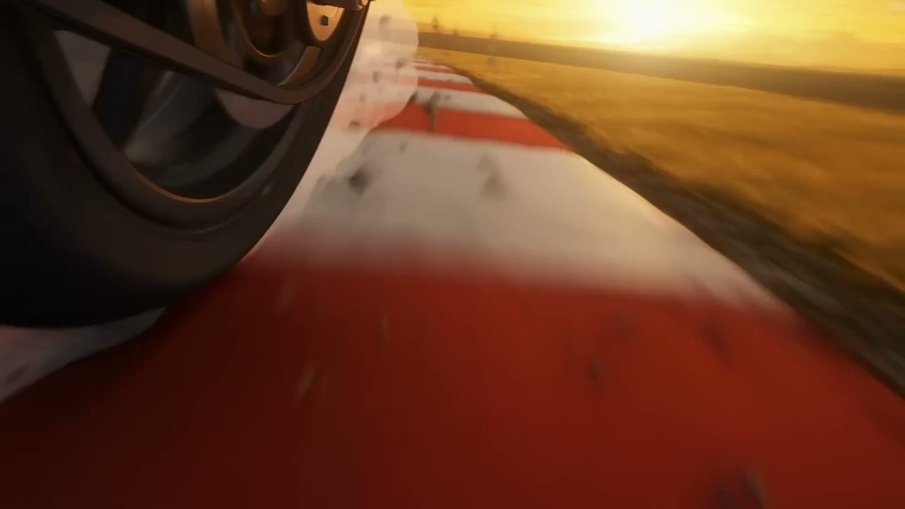](https://ark-common-storage-prod-cn-beijing.tos-cn-beijing.volces.com/presets/experience/gen_video/model-promotion/seedance-2-5/part1/tab3/group2/output.mp4)

[Video abspielen](https://ark-common-storage-prod-cn-beijing.tos-cn-beijing.volces.com/presets/experience/gen_video/model-promotion/seedance-2-5/part1/tab3/group2/output.mp4) · Klicke auf das Thumbnail, um das Video abzuspielen.

**Referenz-Assets:** 1

**Prompt:**

```text
30 Sekunden filmischer Jugend-Rennkurzfilm im 2D-Animationsstil. Der Protagonist ist ein junger Fahrer, der ein Motorrad fährt, um an hochkarätigen Wettbewerben teilzunehmen. Der Gesamtstil ist leidenschaftlich, jugendlich, emotional intensiv und filmisch, mit einem vollständigen Anfang, Übergang und einem klaren emotionalen Bogen. Im gesamten Film kommen nur zwei Arten von Kamerabewegungen zum Einsatz: High-Speed-Tracking und Slow-Motion-Surround. Es gibt nur sehr wenige Zeilen und sie erscheinen auf natürliche Weise wie Erinnerungsfragmente. Der Ton ist aufrichtig, sanft und zurückhaltend, ohne Parolen zu rufen oder übermäßig reißerisch zu wirken. Fühlen Sie sich nicht in einer Katastrophe, äußern Sie sich nicht negativ und übertreiben Sie Science-Fiction nicht. Es konzentriert sich auf Liebe, Unterstützung, Gegenangriff und Wachstum im Rennen der Jugend.
0 Sekunden bis 5 Sekunden
Die Strecke beginnt in der Abenddämmerung mit rasanten und intensiven Rennen. Die Kamera folgt dem Motorrad des jungen Mannes mit hoher Geschwindigkeit dicht am Boden. Die Reifen streift den Streckenrand. Das Motorrad dröhnt, der Wind weht heftig und die Atmosphäre ist angespannt und feurig. Der junge Mann war konzentriert, und die untergehende Sonne zeichnete scharfe Lichter auf die Metallhülle des Autos.
5 Sekunden bis 9 Sekunden
Nach der Einfahrt in eine entscheidende Ecke wurde der Junge plötzlich von seinem Gegner überholt. Die Hochgeschwindigkeitsverfolgung ging weiter und das Bild zeigte das bedrückende Gefühl, dass die Rangliste abnimmt und der Rhythmus gestört wird. In der Nahaufnahme des Helms kommt es zu vorübergehendem Konzentrationsverlust, Atemnot und leichtem Zittern. Der Junge flüsterte: „Kann ich noch aufholen…“
9 Sekunden bis 14 Sekunden
Der Junge fiel zurück, sein Atem wurde schwerer und seine Stimmung erreichte einen Tiefpunkt. Das Rennen hörte nicht auf und die Lokomotive fuhr immer noch mit hoher Geschwindigkeit vorwärts. Während einer Hochgeschwindigkeitsfahrt begannen warme Erinnerungsfragmente in der Szene aufzublitzen: Als er als Kind das Autofahren lernte, stützte ihn jemand von hinten; sein Vater ordnete ihm seinen Helm zu, seine Bewegungen waren sorgfältig und ruhig; vor der Ziellinie blickte ihn ein sanftes Lächeln an; und die hinteren Figuren gehen in der Abenddämmerung Seite an Seite am Hang entlang. Diese Erinnerungen werden mit goldenem Hintergrundlicht, sanfter Zeitlupe und fragmentierten Gefühlen präsentiert.
14 Sekunden bis 18 Sekunden
Die Musik wandelt sich allmählich von depressiv zu erhebend. Aus der Erinnerung kam eine verhaltene und sanfte Stimme: „Hab keine Angst – ich bin immer hier.“ „Bleiben Sie standhaft. Und schauen Sie nach vorne.“ Die Augen des jungen Mannes konzentrierten sich wieder, seine Atmung stabilisierte sich langsam und seine Stimmung änderte sich von schwankend zu fest.
18 Sekunden bis 23 Sekunden
Der junge Mann gewann sein Selbstvertrauen zurück, beschleunigte mit aller Kraft und konterte präzise. Die High-Speed-Kamerafahrten zeigen die Kraft und Kontrolle des Motorrads bei Kurvenfahrten, Kurvenausfahrten und der Annäherung an das vorausfahrende Auto. Der Junge sagte leise, aber bestimmt: „Ich werde hier nicht aufhören.“
23 Sekunden bis 27 Sekunden
Vor ihm erschien eine ansteigende Spur, und der Junge sprintete mit voller Geschwindigkeit gegen die untergehende Sonne. Das Bild behält nur Atemgeräusche, Motorgeräusche und kontinuierlich ansteigende Musik bei, ohne unnötige Zeilen hinzuzufügen. Mithilfe der Trägheit stieg die Lokomotive in die Luft und verfiel in eine schockierende Zeitlupe. Aus der Tiefe meiner Erinnerung ertönte eine sanfte Stimme mit einem Lächeln: „Mach weiter.“
27 Sekunden bis 30 Sekunden
Die Kamera umkreist die Lokomotive in der Luft, um eine Panorama-Nahaufnahme in Zeitlupe zu ermöglichen. Bringen Sie die Gefühle von Leidenschaft, Zärtlichkeit, Freiheit und Aufwärtssprung zum Höhepunkt. Hinter Ihnen blühen Blumen, gefolgt von Samen, siehe<<<image_1_1>>>
```

> [!NOTE]
> Dieser offizielle Case enthält außerdem Referenz-Assets im Manifest.

---

## Erweitern Sie die mehrsprachige Präsentation

### Case 29: Erweitern Sie mehrsprachige Präsentation-mehrsprachige Ausdrucksausgabe-1

[](https://ark-common-storage-prod-cn-beijing.tos-cn-beijing.volces.com/presets/experience/gen_video/model-promotion/seedance-2-5/part3/group1/output.mp4)

[Video abspielen](https://ark-common-storage-prod-cn-beijing.tos-cn-beijing.volces.com/presets/experience/gen_video/model-promotion/seedance-2-5/part3/group1/output.mp4) · Klicke auf das Thumbnail, um das Video abzuspielen.

**Referenz-Assets:** 11

**Prompt:**

```text
One-Shot-Video aus der First-Person-Perspektive einer FPV-Drohne, 33 Sekunden durchgehende Totalaufnahme, kein Schnitt, keine Sprungschnitte, keine Übergänge. Die Kamera startet im Inneren der hochgelegenen Wolken und bildet eine kontinuierlich absteigende Fluglinie entlang der Wolken, Nebel, Licht und Schatten, Täler, Wasserfälle, Seen, Blumenfelder, städtischen Gebäuden und bodennahen Plätzen. Während des gesamten Prozesses erscheinen nacheinander 11 klare und unabhängige Sprachanzeigeblöcke. Jeder Block zeigt nur den Text an, der einer einzelnen Sprache entspricht. Es gibt kein Mischen, Überlappen oder Hinzufügen anderer Sprachen.
0–3 Sekunden,<<<image_1_1>>>-Wolken bilden auf Chinesisch auf natürliche Weise „Hallo“;
3–6 Sekunden,<<<image_2_2>>>Nebel und volumetrisches Licht bilden Englisch „Hallo“;
6–9 Sekunden,<<<image_3_3>>>Wasserdampf- und Sonnenlichtprojektion in großer Höhe bilden das spanische (Mexiko) „Hola“;
9–12 Sekunden,<<<image_4_4>>>Band am Himmel, das das indonesische Wort „Halo“ bildet;
12–15 Sekunden,<<<image_5_5>>>-Drachenformation, die „Hai“ auf Malaiisch bildet;
15–18 Sekunden,<<<image_6_6>>>Morgennebel im Tal bildet thailändisches „สวัสดี“;
18–21 Sekunden<<<image_7_7>>>Wasserfallnebel, der arabisches Wasser bildet
21-24 Sekunden,<<<image_8_8>>>Die Spiegelung auf dem See und die Wellen bilden das portugiesische Wort „Olá“;
24–27 Sekunden,<<<image_9_9>>>Blumenfelder und Wiesen werden auf natürliche Weise im vietnamesischen „Xin chào“ angeordnet;
27–30 Sekunden,<<<image_10_10>>>Glasgebäude der Stadt reflektieren Licht und Schatten und bilden das japanische Wort „こんにちは“;
30–33 Sekunden,<<<image_2_2>>>0 Wassernebel, Bodenbelag und Lichtstreifen in der Nähe eines Brunnens bilden das koreanische Wort „안녕하세요“.
Die Gesamtatmosphäre ist ein Sonnenaufgang am frühen Morgen mit goldener Hintergrundbeleuchtung, weichem volumetrischem Licht, echten Wolken und Nebel, natürlicher Bewegungsunschärfe und Realismus auf Filmniveau. Die Kamerageschwindigkeit beginnt langsam bei 3–5 m/s, beschleunigt sich in der natürlichen Landschaft allmählich auf 14–16 m/s und verlangsamt sich dann auf 2–3 m/s, um stabil im erdnahen Quadrat zu schweben. Objektivparameter: Weitwinkelobjektiv, 24 fps, sanfte FPV-Drohnenbewegung, Neigung geht allmählich von -5° auf -18° über und kehrt schließlich auf 0° zurück; leichtes Gieren ±10°, Rollkontrolle bei 0–10°, was ein kontinuierliches, stabiles und realistisches Fluggefühl von Schuss zu Schuss gewährleistet.
```

> [!NOTE]
> Dieser offizielle Case enthält außerdem Referenz-Assets im Manifest.

---

### Case 30: Erweitern Sie mehrsprachige Präsentation-mehrsprachige Ausdrucksausgabe-2

[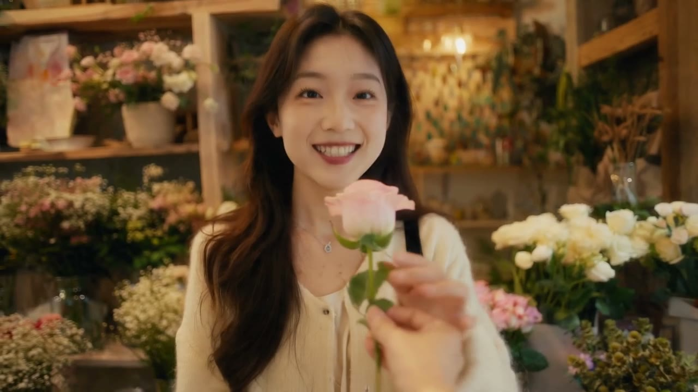](https://ark-common-storage-prod-cn-beijing.tos-cn-beijing.volces.com/presets/experience/gen_video/model-promotion/seedance-2-5/part3/group2/output.mp4)

[Video abspielen](https://ark-common-storage-prod-cn-beijing.tos-cn-beijing.volces.com/presets/experience/gen_video/model-promotion/seedance-2-5/part3/group2/output.mp4) · Klicke auf das Thumbnail, um das Video abzuspielen.

**Referenz-Assets:** 9

**Prompt:**

```text
Live-Action-Stil, schnelle Bearbeitung, Kinogefühl, 4K, 24 fps, warmes natürliches Licht, echte Charakterdarbietungen, natürliche Lippensynchronisation, keine Untertitel. Da die Übergabe einer Blume der zentrale visuelle Hinweis des gesamten Videos ist, breitet sich die Blume schnell von einem Land zum nächsten aus und verbindet verschiedene Regionen und Menschen auf der ganzen Welt. In jeder Szene nimmt eine Figur die Blumen entgegen, lächelt aufrichtig und sagt in der Landessprache „Danke“. Der Gesamtrhythmus ist lebhaft und sanft, und die Aufnahmen sind dynamisch und betonen die echte Straßen-/Lebensatmosphäre, herzliche interkulturelle Verbindungen und die Vermittlung von gutem Willen zwischen den Menschen.
Übergangsmethode: In der vorherigen Einstellung reichte eine Figur die Blume aus dem Bildschirm, und in der nächsten Einstellung fing eine andere Figur die Blume in der neuen Szene auf.
Oder verwenden Sie schnelles Schwenken, Bewegungsunschärfe oder Vordergrundverdeckung, um nahtlose Übergänge zu erzielen
Behalten Sie die visuelle Kontinuität der Blumen im Bild bei, um das Gefühl zu erzeugen, als würde sich „ein Schuss über die ganze Welt ausbreiten“.
Objektivstil: Freihand-Nachfolgeaufnahmen, leichtes Verwackeln der Linse, schnelles Drücken und Ziehen, Kombination aus Nahaufnahme und mittlerer Aufnahme, echte Umgebungsgeräuschatmosphäre und Straßenaufnahmetextur auf Filmniveau. Die Hintergrundmusik ist warm, lebhaft und erinnert an eine Weltreise, und das Ende klingt sanft aus.
Szene 1<<<image_1_1>>>In einem chinesischen Blumenladen, eine Szene aus dem echten Leben. Das Mädchen nahm eine Rose, schaute in die Kamera, lächelte und sagte natürlich: „Danke!“ Die Kamera folgte den Blumen von der rechten Seite des Bildschirms und das Mädchen hob den Blumenstrauß sanft hoch, nachdem es die Blumen erhalten hatte.
Szene 2<<<image_2_2>>>Die Straßen Englands, leicht kühles Wetter, natürliche Straßenszene. Der Mann nahm eine Nelke, lächelte, nickte und sagte: „Danke!“ Durch den Übergang wurde die Blume aus der vorherigen Szene in diese Szene geworfen.
Szene 3<<<image_3_3>>>Mexikanischer Markt, reich an Farben und voller Feuerwerk. Die Tante nahm den Ringelblumenstrauß, faltete die Hände und sagte herzlich: „¡Gracias!“ Die Kamera flog schnell über den Stand und die Menschenmenge, und der Moment der Blumenübergabe wurde eingefroren.
Szene 4<<<image_4_4>>>Indonesische Landschaft, natürliches Sonnenlicht scheint. Das Kind nahm eine Plumeria, lächelte glücklich, verneigte sich leicht und sagte: „Terima kasih!“ Die Kamera hatte das Gefühl, zu laufen, und die Atmosphäre war rein und natürlich.
Szene 5<<<image_5_5>>>Auf den Straßen Thailands wimmelt es von Menschen. Der Verkäufer nahm einen Strauß Jasminkränze, faltete die Hände und sagte freundlich: „ขอบคุณค่ะ!“ Die Kamera bewegte sich zügig vorwärts und die Girlanden schwankten leicht im Sonnenlicht.
Szene 6<<<image_6_6>>>Arabischer Innenhof, sanftes Licht und Schatten, elegante Umgebung. Die Dame nahm eine Wüstenrose, streichelte ihre Brust, lächelte und sagte: „شكراً!“ Das Bild war ruhig und warm und der Gesichtsausdruck der Figur war aufrichtig.
Szene 7<<<image_7_7>>>Brasilianische Gemeinschaft, die Atmosphäre ist warm und lebhaft. Der Junge nahm eine Gerbera und freute sich sehr und sagte: „Obrigado!“ Die Aufnahme ist rhythmisch und voller Leben.
Szene 8<<<image_8_8>>>Auf einer japanischen Straße nahm ein Büroangestellter eine kleine Blume aus der Brotdose, verbeugte sich höflich und sagte: „ありがとう!“ Die Aufnahme war kurz und ordentlich und bewahrte den Sinn für urbanen Rhythmus.
Szene 9<<<image_9_9>>>Koreanische Straßen, modernes urbanes Flair. Die junge Frau nahm einen Azaleenzweig, faltete natürlich die Hände, lächelte und sagte: „감사합니다!“ Die Kamera hielt einen Moment inne, während sie lächelte, dann verschwand die Szene sanft.
```

> [!NOTE]
> Dieser offizielle Case enthält außerdem Referenz-Assets im Manifest.

---

## Tiefer kontrollierbare Bearbeitung

### Case 31: Kontrollierter Edit 1-Ausgang

[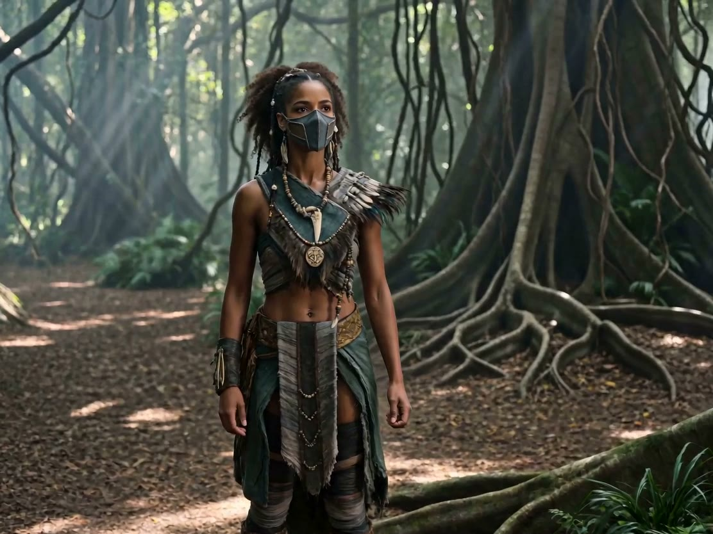](https://ark-common-storage-prod-cn-beijing.tos-cn-beijing.volces.com/presets/experience/gen_video/model-promotion/seedance-2-5/part2/group1/output.mp4)

[Video abspielen](https://ark-common-storage-prod-cn-beijing.tos-cn-beijing.volces.com/presets/experience/gen_video/model-promotion/seedance-2-5/part2/group1/output.mp4) · Klicke auf das Thumbnail, um das Video abzuspielen.

**Referenz-Assets:** 2

**Prompt:**

```text
Behalten Sie die Charaktere, die Dschungelumgebung, die Kamerabewegung, die Komposition, das Action-Tempo und die Dauer von<<<video_1_1>>>bei.
Langsam erscheinen in der Hand des Charakters ein blau-weißer Energiebogen und ein leuchtender Pfeil<<<image_1_2>>>. Der Bogenkörper entsteht nach und nach durch die Polymerisation schwacher Bögen und Partikel mit einer zart fließenden Stromtextur, leichtem volumetrischem Licht und einem stabilen Energieumriss. Beim Spannen des Bogens verdichtet sich der Pfeil in der Mitte der Bogensehne zu einem hochhellen Energiepfeil. Sobald der Charakter loslässt, schießt der Pfeil mit hoher Geschwindigkeit heraus und hinterlässt eine helle, schlanke, kontinuierliche und scharfe Energieflugbahn.
```

> [!NOTE]
> Dieser offizielle Case enthält außerdem Referenz-Assets im Manifest.

---

### Case 32: Kontrollierte Bearbeitung 1 Referenz

[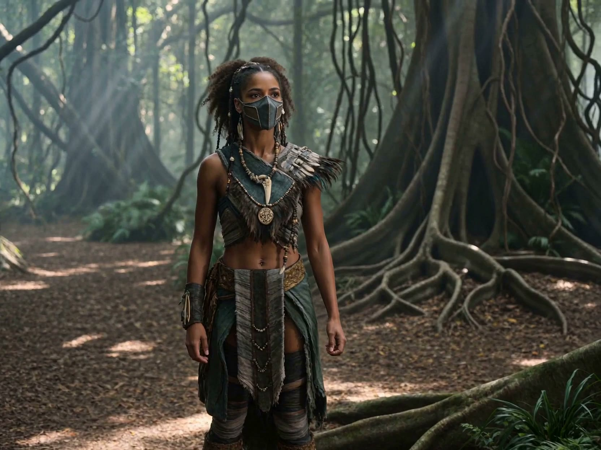](https://ark-common-storage-prod-cn-beijing.tos-cn-beijing.volces.com/presets/experience/gen_video/model-promotion/seedance-2-5/part2/group1/reference1.mp4)

[Video abspielen](https://ark-common-storage-prod-cn-beijing.tos-cn-beijing.volces.com/presets/experience/gen_video/model-promotion/seedance-2-5/part2/group1/reference1.mp4) · Klicke auf das Thumbnail, um das Video abzuspielen.

**Referenz-Assets:** 2

**Prompt:**

```text
Behalten Sie die Charaktere, die Dschungelumgebung, die Kamerabewegung, die Komposition, das Action-Tempo und die Dauer von<<<video_1_1>>>bei.
Langsam erscheinen in der Hand des Charakters ein blau-weißer Energiebogen und ein leuchtender Pfeil<<<image_1_2>>>. Der Bogenkörper entsteht nach und nach durch die Polymerisation schwacher Bögen und Partikel mit einer zart fließenden Stromtextur, leichtem volumetrischem Licht und einem stabilen Energieumriss. Beim Spannen des Bogens verdichtet sich der Pfeil in der Mitte der Bogensehne zu einem hochhellen Energiepfeil. Sobald der Charakter loslässt, schießt der Pfeil mit hoher Geschwindigkeit heraus und hinterlässt eine helle, schlanke, kontinuierliche und scharfe Energieflugbahn.
```

> [!NOTE]
> Dieser offizielle Case enthält außerdem Referenz-Assets im Manifest.

---

### Case 33: Kontrollierte Ausgabe von Edit 2

[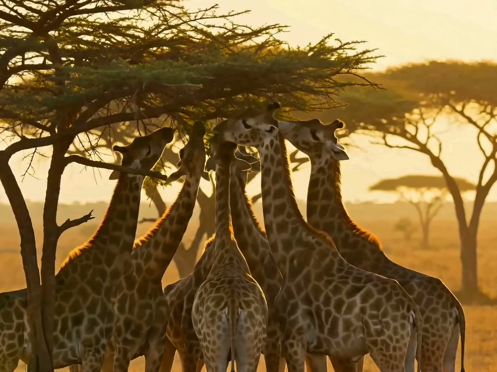](https://ark-common-storage-prod-cn-beijing.tos-cn-beijing.volces.com/presets/experience/gen_video/model-promotion/seedance-2-5/part2/group2/output.mp4)

[Video abspielen](https://ark-common-storage-prod-cn-beijing.tos-cn-beijing.volces.com/presets/experience/gen_video/model-promotion/seedance-2-5/part2/group2/output.mp4) · Klicke auf das Thumbnail, um das Video abzuspielen.

**Referenz-Assets:** 1

**Prompt:**

```text
Löschen Sie die Drohne im<<<video_1_1>>>-Bildschirm und die Vordergrundspur/Karosseriekante in der unteren linken Ecke und vervollständigen Sie den gelöschten Bereich auf natürliche Weise.
Behalten Sie die Giraffengruppe, die Äste, das ferne Grasland, das goldene Sonnenuntergangshintergrundlicht, die Luftperspektive und die Aufnahmekomposition völlig unverändert bei. Der fertige Hintergrund sollte mit der Umgebung übereinstimmen und einen natürlichen Himmel, Astlücken und Grasdetails ohne Verschmieren, Flackern, Verformung, Geisterbilder oder Überlagerungen erzeugen. Stellen Sie sicher, dass das Timing der vorderen und hinteren Bilder des Videos konsistent ist, die Bewegung kontinuierlich ist, die Kantenübergänge natürlich sind und das Gesamtbild dem Originalbild einer echten Aufnahme entspricht.
```

> [!NOTE]
> Dieser offizielle Case enthält außerdem Referenz-Assets im Manifest.

---

### Case 34: Referenz zum kontrollierten Bearbeiten 2

[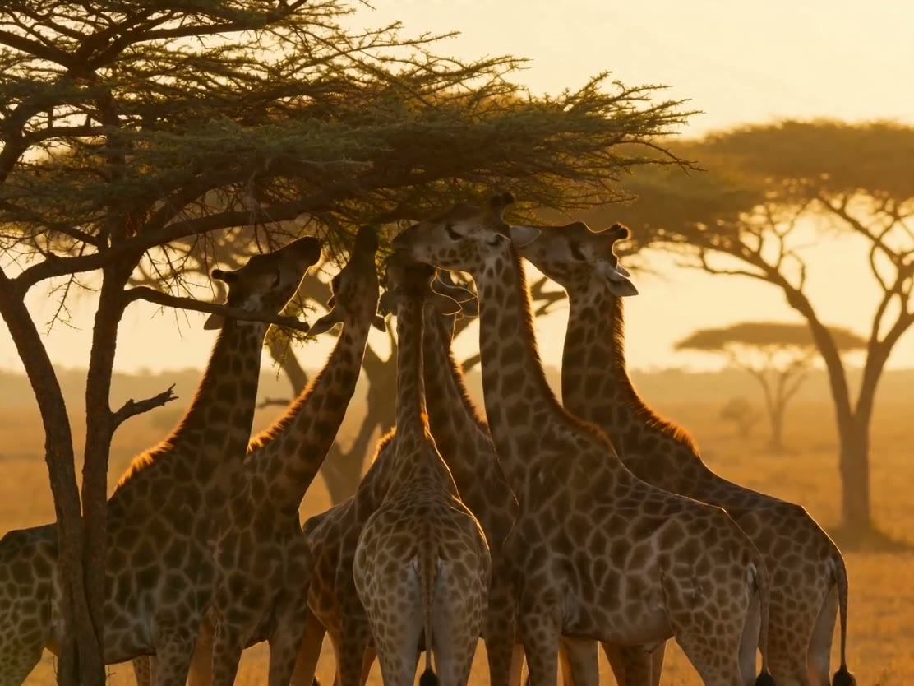](https://ark-common-storage-prod-cn-beijing.tos-cn-beijing.volces.com/presets/experience/gen_video/model-promotion/seedance-2-5/part2/group2/reference1.mp4)

[Video abspielen](https://ark-common-storage-prod-cn-beijing.tos-cn-beijing.volces.com/presets/experience/gen_video/model-promotion/seedance-2-5/part2/group2/reference1.mp4) · Klicke auf das Thumbnail, um das Video abzuspielen.

**Referenz-Assets:** 1

**Prompt:**

```text
Löschen Sie die Drohne im<<<video_1_1>>>-Bildschirm und die Vordergrundspur/Karosseriekante in der unteren linken Ecke und vervollständigen Sie den gelöschten Bereich auf natürliche Weise.
Behalten Sie die Giraffengruppe, die Äste, das ferne Grasland, das goldene Sonnenuntergangshintergrundlicht, die Luftperspektive und die Aufnahmekomposition völlig unverändert bei. Der fertige Hintergrund sollte mit der Umgebung übereinstimmen und einen natürlichen Himmel, Astlücken und Grasdetails ohne Verschmieren, Flackern, Verformung, Geisterbilder oder Überlagerungen erzeugen. Stellen Sie sicher, dass das Timing der vorderen und hinteren Bilder des Videos konsistent ist, die Bewegung kontinuierlich ist, die Kantenübergänge natürlich sind und das Gesamtbild dem Originalbild einer echten Aufnahme entspricht.
```

> [!NOTE]
> Dieser offizielle Case enthält außerdem Referenz-Assets im Manifest.

---

### Case 35: Kontrollierte Edit-3-Ausgabe

[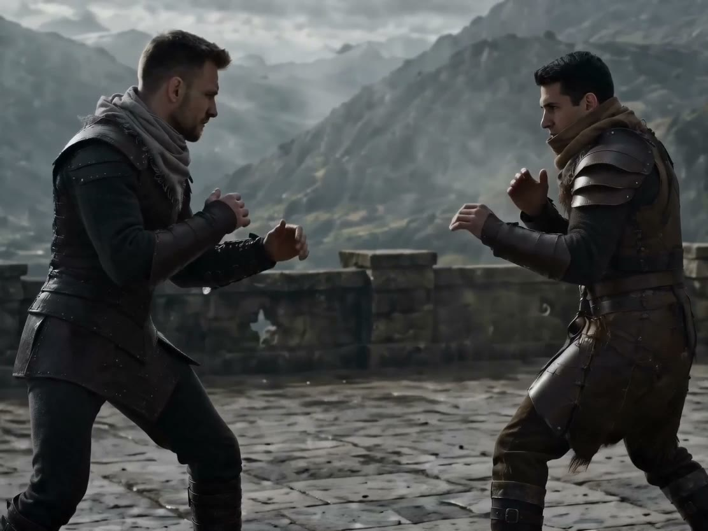](https://ark-common-storage-prod-cn-beijing.tos-cn-beijing.volces.com/presets/experience/gen_video/model-promotion/seedance-2-5/part2/group3/output.mp4)

[Video abspielen](https://ark-common-storage-prod-cn-beijing.tos-cn-beijing.volces.com/presets/experience/gen_video/model-promotion/seedance-2-5/part2/group3/output.mp4) · Klicke auf das Thumbnail, um das Video abzuspielen.

**Referenz-Assets:** 4

**Prompt:**

```text
Ersetzte die Originalversion des Zwei-Personen-Kampfsportvideos<<<video_1_1>>>durch einen Test mit leeren Händen vor einem Kaltwaffenduell.
Die Szene wird durch eine mittelalterliche Steinburgplattform, eine alte Hofwohnung, eine äußere Plattform einer Bergfestung oder ein einfaches Duellfeld aus Steinziegeln ersetzt. Der Hintergrund ist die alte Burgmauer, Wind, Nebel, eine ferne Berglinie und der Boden ist flach und steinig<<<image_1_2>>>.
Die Kleidung des Mannes in dunkler Kleidung im Video wird durch<<<image_2_3>>>ersetzt, und die Kleidung des Mannes in heller Kleidung im Video wird durch<<<image_3_4>>>ersetzt. Die Aktion bleibt gleich, ohne den ursprünglichen Rhythmus zu verändern.
KI-Spezialeffekte verbessern nur die Umgebung und die Textur: vom Wind verwehte Kleidung, leichter Nebel, eine kleine Menge Staub an Kontaktpunkten, metallische, kältereflektierende Textur, leichte Partikel und eine epische Farbpalette. Der Gesamtstil ist zurückhaltend, realistisch und bietet eine klassische Hardcore-Duell-Atmosphäre. Hintergrundmusik blieb hängen
```

> [!NOTE]
> Dieser offizielle Case enthält außerdem Referenz-Assets im Manifest.

---

### Case 36: Referenz zum kontrollierten Bearbeiten 3

[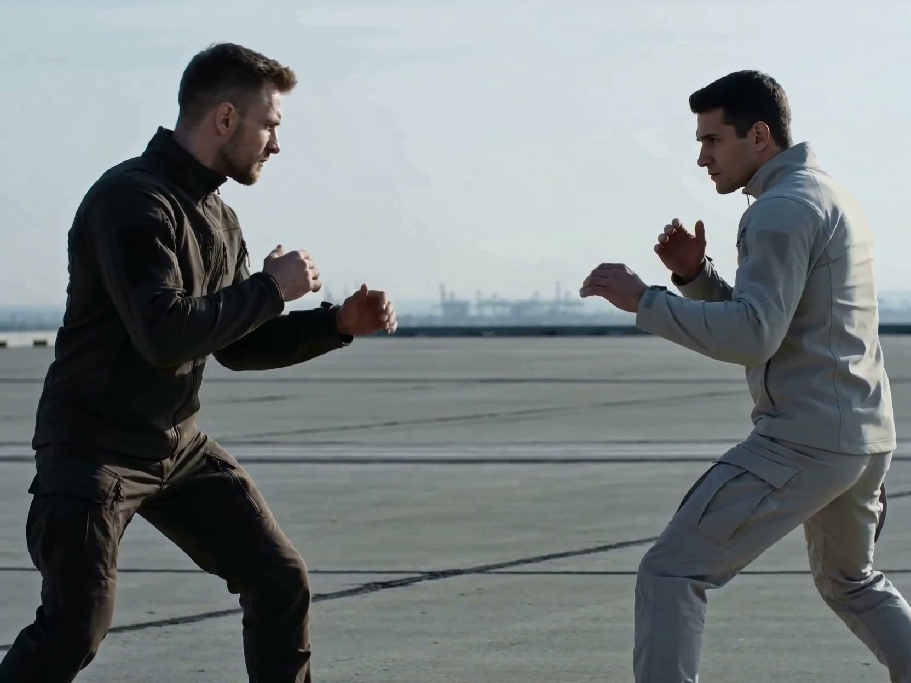](https://ark-common-storage-prod-cn-beijing.tos-cn-beijing.volces.com/presets/experience/gen_video/model-promotion/seedance-2-5/part2/group3/reference1.mp4)

[Video abspielen](https://ark-common-storage-prod-cn-beijing.tos-cn-beijing.volces.com/presets/experience/gen_video/model-promotion/seedance-2-5/part2/group3/reference1.mp4) · Klicke auf das Thumbnail, um das Video abzuspielen.

**Referenz-Assets:** 4

**Prompt:**

```text
Ersetzte die Originalversion des Zwei-Personen-Kampfsportvideos<<<video_1_1>>>durch einen Test mit leeren Händen vor einem Kaltwaffenduell.
Die Szene wird durch eine mittelalterliche Steinburgplattform, eine alte Hofwohnung, eine äußere Plattform einer Bergfestung oder ein einfaches Duellfeld aus Steinziegeln ersetzt. Der Hintergrund ist die alte Burgmauer, Wind, Nebel, eine ferne Berglinie und der Boden ist flach und steinig<<<image_1_2>>>.
Die Kleidung des Mannes in dunkler Kleidung im Video wird durch<<<image_2_3>>>ersetzt, und die Kleidung des Mannes in heller Kleidung im Video wird durch<<<image_3_4>>>ersetzt. Die Aktion bleibt gleich, ohne den ursprünglichen Rhythmus zu verändern.
KI-Spezialeffekte verbessern nur die Umgebung und die Textur: vom Wind verwehte Kleidung, leichter Nebel, eine kleine Menge Staub an Kontaktpunkten, metallische, kältereflektierende Textur, leichte Partikel und eine epische Farbpalette. Der Gesamtstil ist zurückhaltend, realistisch und bietet eine klassische Hardcore-Duell-Atmosphäre. Hintergrundmusik blieb hängen
```

> [!NOTE]
> Dieser offizielle Case enthält außerdem Referenz-Assets im Manifest.

---

## 📁 Repository-Struktur

```text
.
├── README.md
├── README.<lang>.md
├── assets/
│   ├── banner.png
│   └── thumbnails/
├── data/
│   ├── seedance-2-5-manifest.json
│   └── seedance-2-5-prompt-translations.json
└── use-cases/
    ├── README.md
    ├── en/
    │   ├── README.md
    │   ├── 01-consistency.md
    │   └── official-seedance-2-5-guide.md
    └── <lang>/
        ├── README.md
        └── official-seedance-2-5-guide.md
```

## 🙏 Anerkennung

Dieses Repository wird von EvoLink als öffentlicher Guide für Seedance 2.5 early access gepflegt.

- Official early access: [Get Seedance 2.5 Early Access](https://evolink.ai/seedream-5-0?utm_source=github&utm_medium=readme&utm_campaign=awesome-seedance-2.5-guide)
- Current API key path: [EvoLink signup](https://evolink.ai/signup?utm_source=github&utm_medium=readme&utm_campaign=awesome-seedance-2.5-guide)
- Current API examples: [Seedance 2.5 Gateway Service](https://github.com/EvoLinkAI/Seedance-2.5-Gateway-Service)
